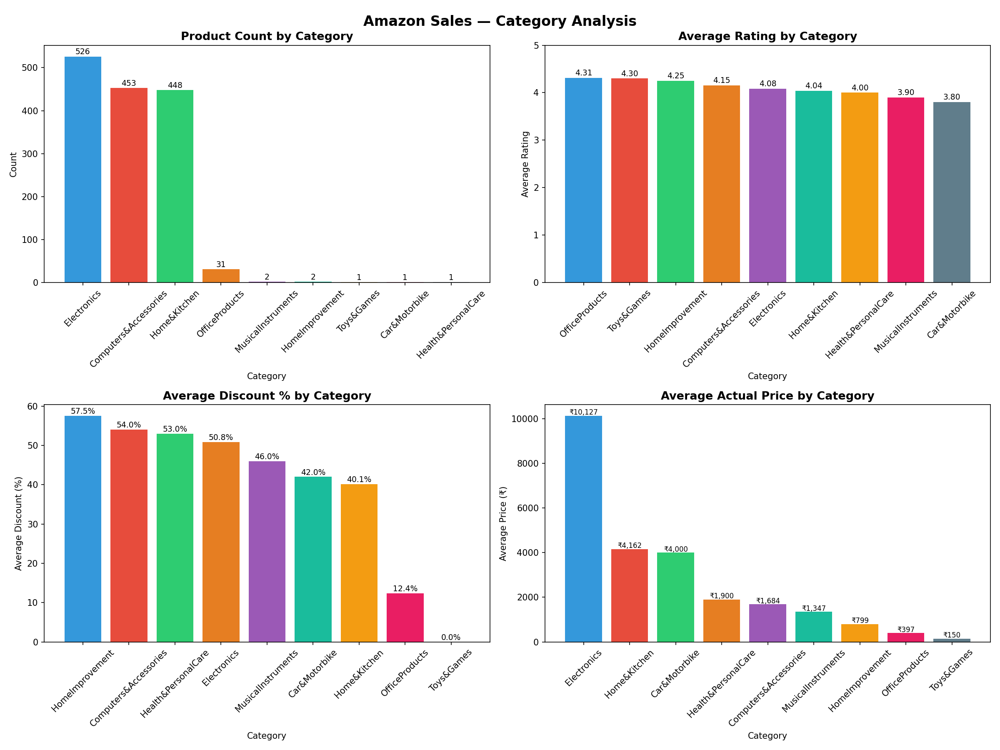
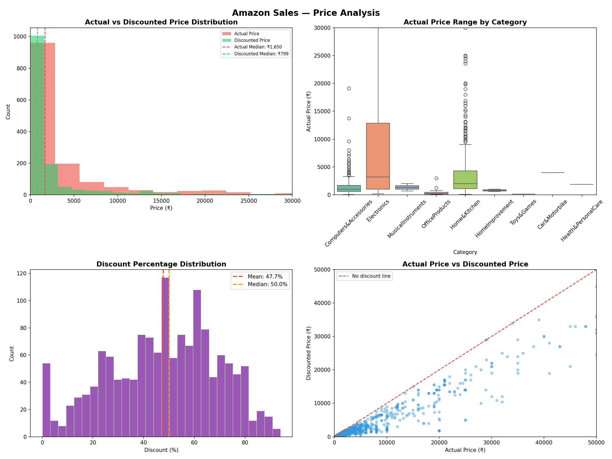
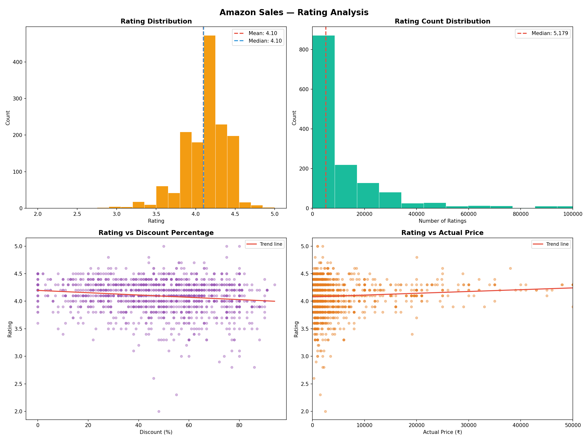
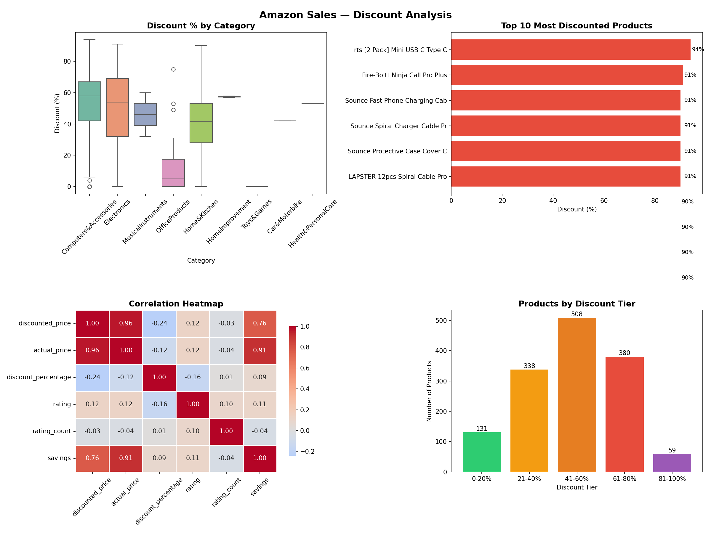
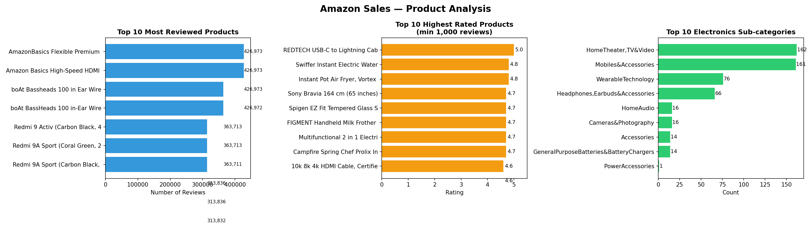

# 🛒 Amazon Sales — Exploratory Data Analysis

An exploratory data analysis project using Python, pandas, matplotlib, and seaborn on an Amazon sales dataset containing 1,465 product listings across multiple categories. The dataset includes pricing, discounts, ratings, and review data — making it ideal for understanding Amazon's pricing strategy and customer behavior.

---

## 📁 Project Structure

```
Amazon_Sales_EDA/
│
├── data_source/
│   └── amazon.csv                        # raw dataset (1,465 records)
│
├── visualizations/
│   ├── category_analysis.png             # 4 charts — category overview
│   ├── price_analysis.png                # 4 charts — price distributions
│   ├── rating_analysis.png               # 4 charts — rating patterns
│   ├── discount_analysis.png             # 4 charts — discount breakdown
│   └── product_analysis.png             # 3 charts — top products
│
└── amazon_eda.ipynb                      # EDA notebook
```

---

## 📊 Dataset Overview

| Property | Detail |
|---|---|
| Rows | 1,465 |
| Columns | 16 (raw) → 11 (after cleaning) |
| Categories | 9 main categories |
| Price Range | ₹39 — ₹1,39,900 |
| Average Discount | 47.7% |
| Average Rating | 4.1 / 5.0 |
| Missing Values | 2 (rating_count) — filled with median |

### Columns Used

| Column | Description |
|---|---|
| `product_id` | Unique product identifier |
| `product_name` | Name of the product |
| `category` | Full nested category path |
| `discounted_price` | Price after discount (₹) |
| `actual_price` | Original price (₹) |
| `discount_percentage` | Discount applied (%) |
| `rating` | Average product rating (0–5) |
| `rating_count` | Number of customer ratings |
| `main_category` | Extracted top-level category |
| `savings` | Absolute savings (actual - discounted) |
| `discount_tier` | Binned discount range |

### Columns Dropped
`img_link`, `product_link`, `review_id`, `user_id`, `user_name`, `review_title`, `review_content`, `about_product` — not needed for numerical analysis

---

## 🧹 Data Cleaning

| Step | Action |
|---|---|
| Removed ₹ and , from prices | Converted to float64 |
| Removed % from discount | Converted to float64 |
| Converted rating to numeric | Used `errors='coerce'` |
| Filled 2 null rating_counts | Replaced with median |
| Extracted main_category | Split category string by `\|` |
| Added savings column | `actual_price - discounted_price` |
| Added discount_tier column | Binned into 5 ranges |

---

## 🔍 Key Findings at a Glance

| Metric | Value |
|---|---|
| Most products | Electronics (526) |
| Highest rated category | Office Products (4.31 avg) |
| Most discounted category | Home Improvement (57.5%) |
| Most expensive category | Electronics (₹10,127 avg) |
| Median actual price | ₹1,650 |
| Median discounted price | ₹799 |
| Most common discount tier | 41–60% (508 products) |
| Highest discount | 94% (USB C Type C cable) |
| Most reviewed product | AmazonBasics HDMI (426,973 reviews) |
| Perfect rated product | REDTECH USB-C Cable (5.0 — 1000+ reviews) |

---

## 📈 Analysis & Insights

### 1. Category Analysis

**Product Count:**
- Electronics leads with **526 products (35.9%)**
- Computers & Accessories — 453 (30.9%)
- Home & Kitchen — 448 (30.6%)
- Bottom 6 categories combined — only 38 products

**Average Rating by Category:**
- Office Products highest at **4.31** despite having only 31 products
- Car & Motorbike lowest at **3.80**
- All categories rate above 3.8 — no poorly rated category

**Average Discount:**
- Home Improvement gives the most discount at **57.5%**
- Computers & Accessories at **54%**
- Office Products nearly zero discount at **0%** — sold at full price
- Toys & Games at **12.4%**

**Average Price:**
- Electronics most expensive at **₹10,127 average**
- Home & Kitchen and Computers at ₹4,000–₹4,162
- Toys & Games cheapest at ₹150 average



---

### 2. Price Analysis

**Distribution:**
- Heavily right-skewed — most products under ₹5,000
- Median actual price **₹1,650** vs median discounted **₹799** — customers save nearly half
- A small number of premium products extend to ₹1,39,900

**Price Range by Category:**
- Electronics has the widest price range — from budget to premium
- Office Products tightly clustered at low prices
- Home & Kitchen shows significant outliers at high end

**Discount Distribution:**
- Bimodal distribution — peaks at ~10% and ~60%
- Mean discount **47.7%**, median **50%**
- Suggests two types of sellers — low discounters and heavy discounters

**Price vs Discounted Price Scatter:**
- All points below the diagonal — every product has some discount
- Strong linear relationship — higher priced products maintain proportional discounts



---

### 3. Rating Analysis

**Distribution:**
- Tightly clustered between **4.0–4.3**
- Very few products below 3.5 — Amazon likely filters out poorly rated products
- Mean and median both at **4.1**

**Rating Count:**
- Heavily skewed — most products have fewer than 5,000 reviews
- Median rating count — **5,179**
- A handful of products have 300,000+ reviews

**Rating vs Discount:**
- Trend line nearly flat — discount percentage does not significantly affect rating
- High discounts do not mean lower quality products

**Rating vs Price:**
- Slight positive trend — more expensive products rated marginally higher
- Correlation is weak — price alone does not determine quality perception



---

### 4. Discount Analysis

**By Category:**
- Computers & Accessories has the widest discount range — most variable pricing
- Office Products nearly zero discount across all products
- Electronics and Home & Kitchen have consistent 40–60% discounts

**Top Discounted Products:**
- Top discounts are **91–94%** — all cables and accessories
- Accessories category dominates extreme discounting

**Correlation Heatmap:**
- `actual_price` and `savings` correlate at **0.91** — more expensive products save more in absolute terms
- `discount_percentage` negatively correlates with `discounted_price` at **-0.24** — higher discounts on cheaper products
- `rating` and `discount_percentage` have near-zero correlation (**-0.16**) — discounts don't affect ratings

**Discount Tier:**
- **41–60% tier** is the most popular — 508 products
- Only 59 products offer 81–100% discount
- 131 products offer 0–20% discount — premium or niche items



---

### 5. Product Analysis

**Most Reviewed:**
- AmazonBasics Flexible Premium HDMI and Amazon Basics High-Speed HDMI — **426,973 reviews each**
- boAt BassHeads 100 appears twice with slight name variation — same product
- Redmi 9A and 9A Sport dominate the smartphone segment

**Highest Rated (min 1,000 reviews):**
- REDTECH USB-C to Lightning Cable — perfect **5.0 rating**
- Swiffer Instant Electric Water Heater and Instant Pot Air Fryer — **4.8**
- Sony Bravia 65 inch TV — **4.7**

**Electronics Sub-categories:**
- Home Theater, TV & Video leads with **162 products**
- Mobiles & Accessories close behind at **161**
- Wearable Technology third at **76**
- Power Accessories has only **1 product**



---

## 🧠 Key Business Insights

1. **Amazon heavily discounts accessories** — cables and chargers have the highest discounts (91–94%), likely used as loss leaders to drive traffic

2. **Price does not determine rating** — correlation between actual price and rating is near zero, meaning customers rate cheap and expensive products equally fairly

3. **Discount does not improve rating** — sellers cannot buy better ratings through higher discounts

4. **Office Products anomaly** — highest average rating (4.31) with nearly zero discounting, suggesting these are niche professional products with loyal buyers

5. **AmazonBasics dominates reviews** — the in-house brand captures the most reviewed products, suggesting strong brand trust for basic accessories

6. **The 41–60% discount sweet spot** — the most common discount tier, suggesting Amazon and sellers have converged on this range as the optimal pricing strategy

7. **Electronics is the most valuable category** — highest average price (₹10,127) AND highest product count (526) — the core revenue driver

---

## 🛠️ Tools Used

- Python 3.12
- pandas
- NumPy
- matplotlib
- seaborn
- Jupyter Notebook

---

## 🚀 How to Run

1. Clone the repository
2. Install dependencies
```bash
pip install pandas numpy matplotlib seaborn jupyter
```
3. Open the notebook
```bash
jupyter notebook amazon_eda.ipynb
```

---

## 📂 Dataset

- **Source:** [Kaggle — Amazon Sales Dataset EDA by Mehak Iftikhar](https://www.kaggle.com/code/mehakiftikhar/amazon-sales-dataset-eda#notebook-container)
- **Records:** 1,465 Amazon product listings
- **Type:** Real Amazon product data including prices, ratings, and reviews

---

## 👤 Author

**NIO**
Fourth exploratory data analysis portfolio project — focused on pricing strategy, discount patterns, and customer rating behavior on Amazon
