# 🔬 Breast Cancer Diagnosis — Exploratory Data Analysis

An exploratory data analysis project using Python, pandas, matplotlib, and seaborn on the Breast Cancer Wisconsin Diagnostic Dataset. The dataset contains 569 breast mass samples with 30 numerical features derived from digitized fine needle aspirate (FNA) images — with a binary target variable `diagnosis` (Benign or Malignant) driving every insight in this analysis.

> ⚠️ This project involves real medical data. All insights are analytical and educational in nature.

---

## 📁 Project Structure

```
Breast_Cancer_EDA/
│
├── data/
│   └── breast_cancer.csv                        # main dataset (569 records)
│
├── visualizations/
│   ├── diagnosis_distribution.png               # benign vs malignant count & pie
│   ├── correlation_heatmap_all.png              # heatmap of all 30 features
│   ├── top10_corr_diagnosis.png                 # top 10 features correlated with diagnosis
│   ├── boxplots_mean_features.png               # all 10 mean features — M vs B
│   ├── boxplots_worst_features.png              # all 10 worst features — M vs B
│   ├── histograms_key_features.png              # distributions of 4 key features
│   ├── violin_plots.png                         # violin plots — 4 key features
│   ├── scatter_radius_area.png                  # radius mean vs area mean
│   ├── scatter_concavity_concave.png            # concavity vs concave points
│   ├── scatter_texture_smoothness.png           # texture vs smoothness
│   ├── pairplot_top5.png                        # pairplot — top 5 features
│   ├── feature_comparison_normalized.png        # normalized mean feature comparison
│   ├── worst_features_corr.png                  # worst features correlation
│   ├── se_features_corr.png                     # SE features correlation
│   ├── top3_worst_dist.png                      # top 3 worst feature distributions
│   ├── radar_chart.png                          # radar chart — feature profile
│   ├── kde_radius_mean.png                      # KDE plot — radius mean
│   ├── corr_three_categories.png               # mean vs SE vs worst correlation
│   ├── swarm_plots.png                          # swarm plots — top predictive features
│   └── summary_stats_table.png                 # mean stats table — M vs B
│
└── breast_cancer_eda.ipynb                      # EDA notebook
```

---

## 📊 Dataset Overview

| Property | Detail |
|---|---|
| Rows | 569 |
| Columns | 32 (30 features + ID + diagnosis) |
| Target Variable | `diagnosis` (M = Malignant, B = Benign) |
| Benign cases | 357 (62.7%) |
| Malignant cases | 212 (37.3%) |
| Missing Values | None |
| Feature Categories | Mean, Standard Error (SE), Worst |
| Source | University of Wisconsin |

### Feature Categories

| Category | Description | Count |
|---|---|---|
| `_mean` | Average measurement per sample | 10 features |
| `_se` | Standard error of measurement | 10 features |
| `_worst` | Largest (worst) value per sample | 10 features |

### 10 Measurements per Category

radius, texture, perimeter, area, smoothness, compactness, concavity, concave points, symmetry, fractal dimension

---

## 🔍 Key Findings at a Glance

| Feature | Benign (B) Mean | Malignant (M) Mean | Difference |
|---|---|---|---|
| `radius_mean` | 12.15 | 17.46 | +43.7% |
| `area_mean` | 462.8 | 978.4 | +111.4% |
| `perimeter_mean` | 78.1 | 115.4 | +47.8% |
| `concavity_mean` | 0.046 | 0.161 | +250% |
| `concave points_mean` | 0.026 | 0.088 | +238.5% |
| `symmetry_mean` | 0.174 | 0.193 | +10.9% |
| `fractal_dimension_mean` | 0.0629 | 0.0627 | ~0% |

---

## 📈 Analysis & Insights

### 1. Diagnosis Distribution
- **357 benign (62.7%)** and **212 malignant (37.3%)** cases
- Relatively balanced dataset — good for classification modeling
- No class imbalance issues that would require resampling

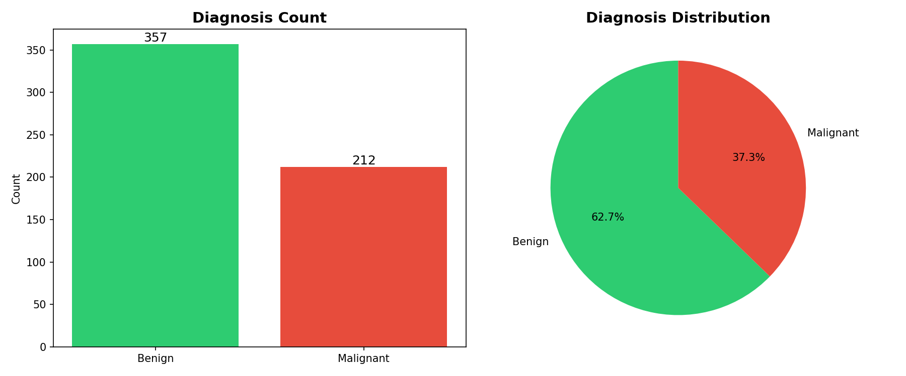

---

### 2. Correlation Heatmap — All 30 Features
- Strong multicollinearity exists — radius, perimeter, and area are highly correlated with each other (expected, as area = π × radius²)
- Concave points, concavity, and compactness cluster together
- Fractal dimension shows the weakest correlations across all features

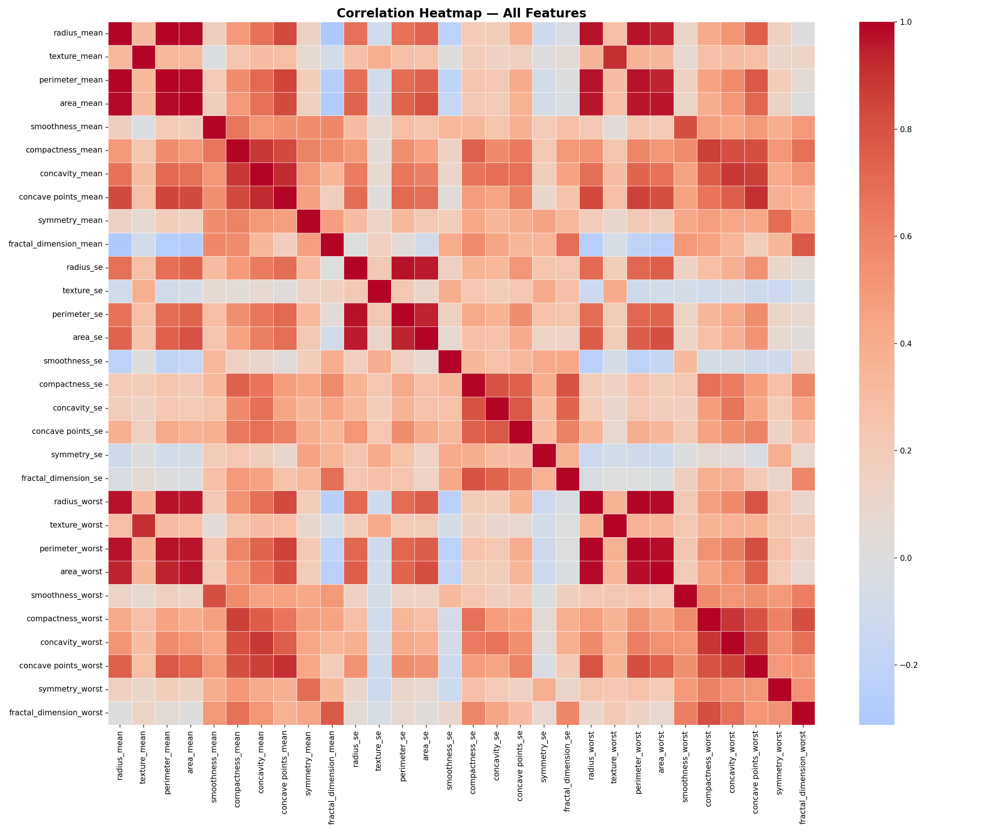

---

### 3. Top 10 Features Correlated with Diagnosis
- **`concave points_worst`** is the single strongest predictor at **0.79**
- **`perimeter_worst`**, **`concave points_mean`**, and **`radius_worst`** all at **0.78**
- **`radius_mean`** and **`area_worst`** at **0.73**
- **`fractal_dimension_mean`** (not shown) is the weakest predictor — near zero correlation

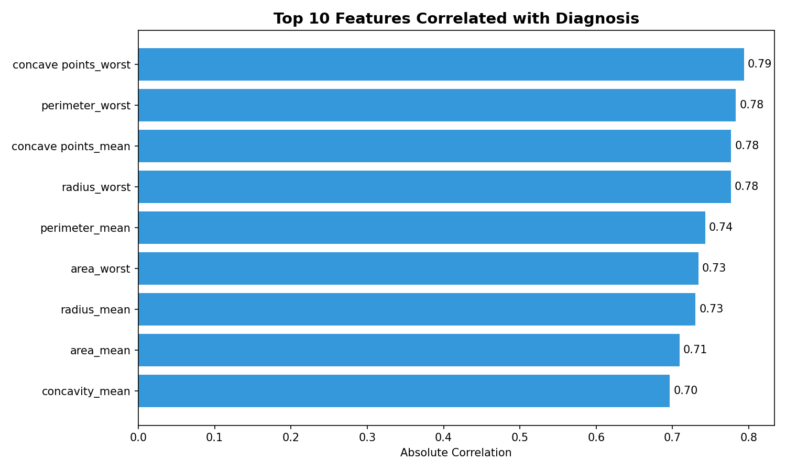

---

### 4. Mean Features — Benign vs Malignant (Box Plots)
- **Radius, perimeter, area** show the clearest separation — malignant tumors are significantly larger
- **Concave points and concavity** show dramatic differences — malignant tumors are far more irregular
- **Fractal dimension** shows almost no difference — overlapping boxes confirm it is not a useful predictor
- **Smoothness and symmetry** show moderate differences

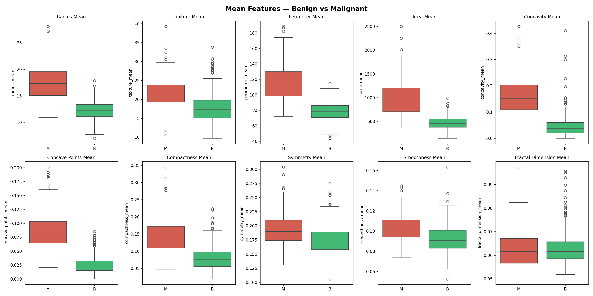

---

### 5. Worst Features — Benign vs Malignant (Box Plots)
- Worst features show even clearer separation than mean features — worst values amplify the differences
- **`concave points_worst`** is the most cleanly separated feature across both groups
- **`texture_worst`** is the only worst feature where benign values overlap significantly with malignant

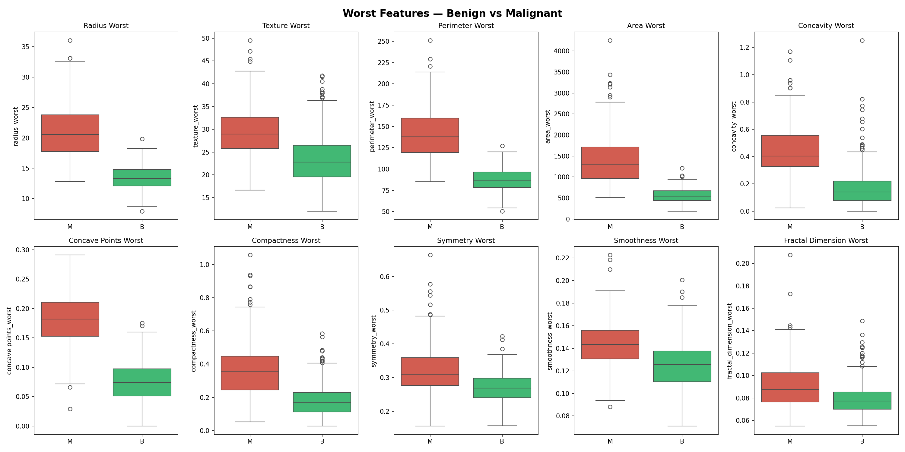

---

### 6. Feature Distributions — Histograms
- **Radius mean**: benign peaks at ~12, malignant peaks at ~18-20 — clear bimodal separation
- **Area mean**: benign tightly clustered under 1,000, malignant spreads from 500–2,500
- **Concavity mean**: benign heavily concentrated near 0, malignant spread across 0–0.4
- All four histograms confirm that benign distributions are narrower and lower-valued

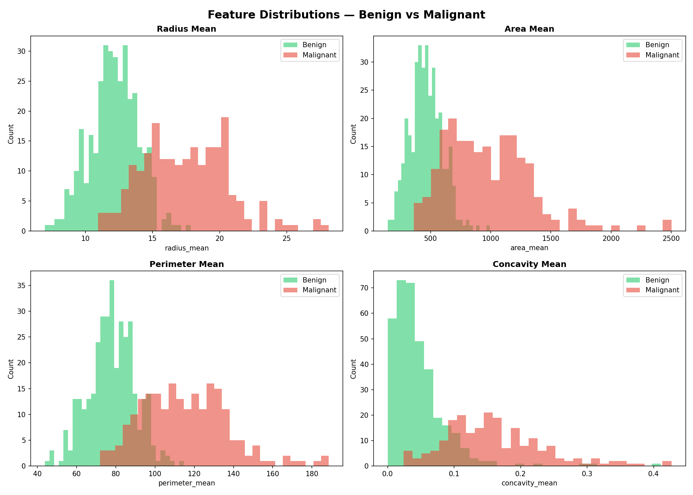

---

### 7. Violin Plots — Key Features
- **Radius**: malignant violin wider and higher — broader range of large tumors
- **Texture**: distributions overlap more than other features — texture alone is weaker predictor
- **Smoothness**: moderate separation — malignant slightly smoother on average
- **Concavity**: benign violin extremely thin near zero, malignant spread wide — strongest visual separation

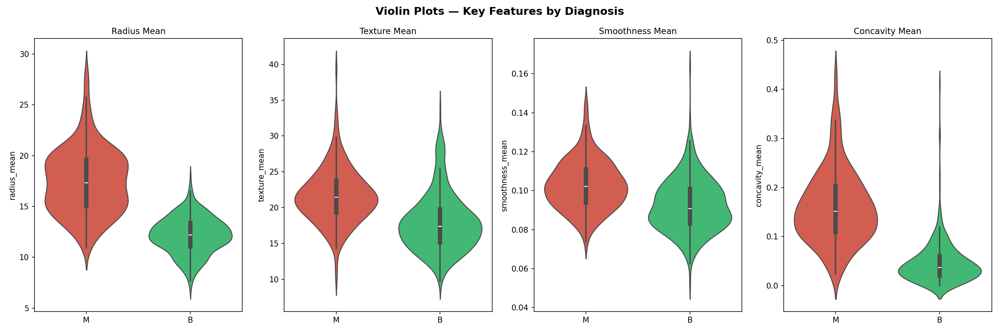

---

### 8. Scatter — Radius Mean vs Area Mean
- Near-perfect curved relationship (area ≈ π × radius²) visible in the scatter
- **Clear cluster separation**: benign (green) in lower-left, malignant (red) in upper-right
- Very little overlap between the two groups — these two features together are strong classifiers

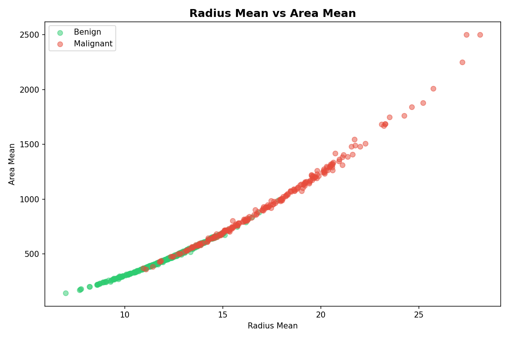

---

### 9. Pairplot — Top 5 Features
- The single most information-rich chart in this project
- **Diagonal KDE plots** show clear distribution separation for radius, perimeter, and area
- **Concavity vs concave points** scatter shows near-zero benign values vs spread malignant values
- Every feature combination shows some degree of separation — confirms the dataset is highly predictive

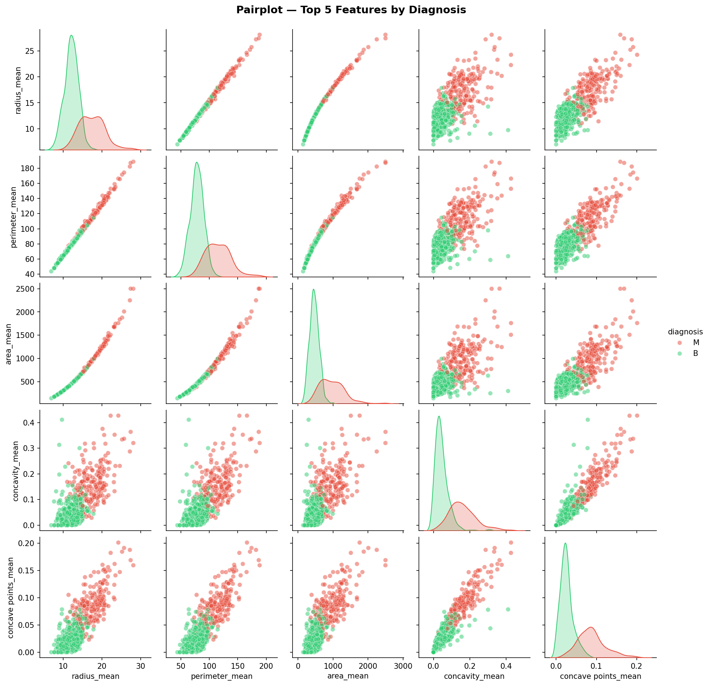

---

### 10. Radar Chart — Feature Profile
- **Malignant tumors extend outward** in nearly every dimension — larger, more irregular, more concave
- **Concave points** and **perimeter** show the biggest gap between M and B
- **Fractal dimension** is the only axis where both profiles nearly overlap
- **Symmetry** is the smallest non-zero difference — malignant tumors are marginally more asymmetric

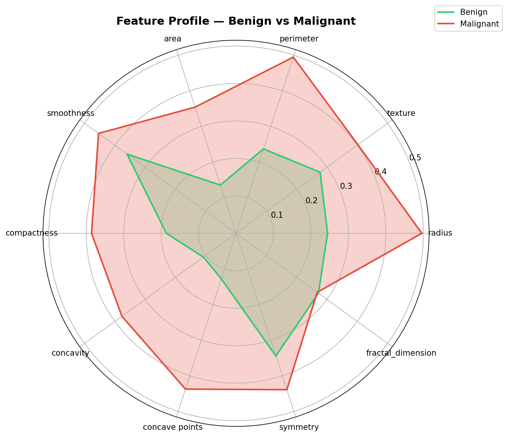

---

### 11. Worst Features — Correlation with Diagnosis
- `concave points_worst` leads at **0.79**, followed by `perimeter_worst` and `radius_worst` at **0.78**
- `fractal_dimension_worst` is weakest at **0.32** — consistent with mean features
- All worst features have higher correlations than their mean counterparts

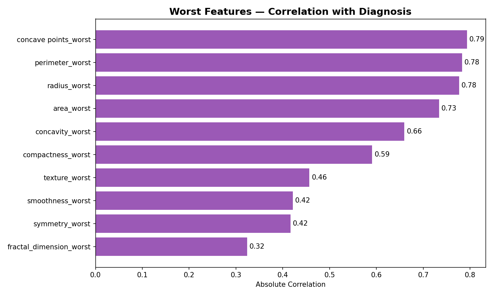

---

### 12. Feature Correlation — Mean vs SE vs Worst
- **Worst features** consistently outperform mean features in correlation with diagnosis
- **SE features** are the weakest predictors overall — radius_se is highest at ~0.57
- **`texture_se` and `symmetry_se`** are nearly useless as standalone predictors (~0.01)
- The pattern is clear: **worst > mean > SE** for predictive power

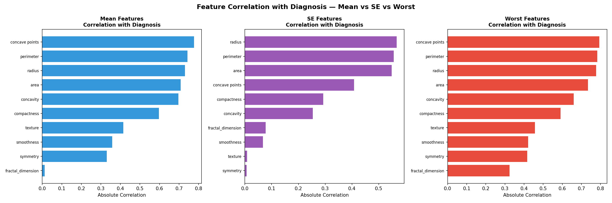

---

### 13. Swarm Plots — Top Predictive Features
- Every dot represents one patient — shows the full distribution with no information lost
- **`concave points_mean`**: malignant cluster sits entirely above benign cluster with minimal overlap
- **`perimeter_worst`**: clean separation — benign tightly packed under 120, malignant above 120
- **`radius_worst`**: similar pattern — very few overlapping data points between M and B

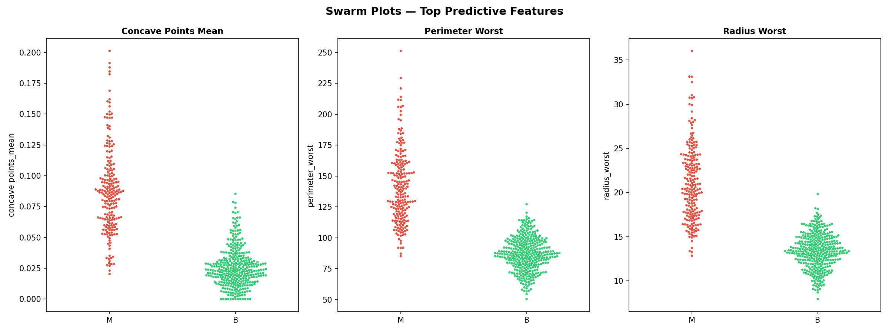

---

### 14. Top Worst Features — Distribution
- **Radius worst**: benign peaks sharply at ~13, malignant spreads from 15–35
- **Area worst**: benign tightly under 1,000, malignant extends to 4,000+
- **Concave points worst**: benign clusters at 0.05–0.10, malignant at 0.15–0.25

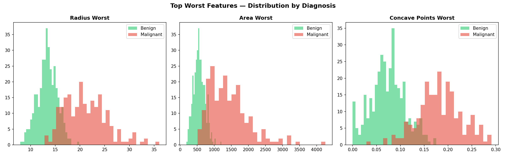

---

## 🧠 Key Medical Insights

1. **Size is the strongest indicator** — malignant tumors have significantly larger radius, perimeter, and area in both mean and worst measurements

2. **Shape irregularity matters** — concave points and concavity show the most dramatic differences between benign and malignant, with malignant tumors having far more irregular, concave contours

3. **Fractal dimension is the exception** — the only feature where benign (0.0629) and malignant (0.0627) are statistically identical, meaning boundary complexity alone cannot distinguish tumor type

4. **Worst features outperform mean features** — the extreme (worst) measurement of a sample is more diagnostic than the average measurement

5. **SE features are weak predictors** — variability of measurements within a sample adds little predictive value compared to the actual measurements themselves

---

## 🛠️ Tools Used

- Python 3.12
- pandas
- NumPy
- matplotlib
- seaborn
- scikit-learn (MinMaxScaler for normalization)
- Jupyter Notebook

---

## 🚀 How to Run

1. Clone the repository
2. Install dependencies
```bash
pip install pandas numpy matplotlib seaborn scikit-learn jupyter
```
3. Open the notebook
```bash
jupyter notebook breast_cancer_eda.ipynb
```

---

## 📂 Dataset

- **Source:** [Kaggle — Breast Cancer Dataset by Wasiq Ali Yasir](https://www.kaggle.com/datasets/wasiqaliyasir/breast-cancer-dataset/data)
- **Original Source:** University of Wisconsin — Breast Cancer Wisconsin (Diagnostic) Data Set
- **Records:** 569 breast mass samples
- **Type:** Real medical data from digitized FNA images

---

## 👤 Author

**NIO**
Third exploratory data analysis portfolio project — first project on real medical data, focused on feature analysis for breast cancer diagnosis classification
