# 🔬 Breast Cancer Diagnosis — Exploratory Data Analysis

An exploratory data analysis project using Python, pandas, matplotlib, and seaborn on the Breast Cancer Wisconsin Diagnostic Dataset. The dataset contains 569 breast mass samples with 30 numerical features derived from digitized fine needle aspirate (FNA) images — with a binary target variable `diagnosis` (Benign or Malignant) driving every insight in this analysis.

> ⚠️ This project involves real medical data. All insights are analytical and educational in nature.

---

## 📁 Project Structure

```
Breast_Cancer_EDA/
│
├── data/
│   └── breast_cancer.csv                        # main dataset (569 records)
│
├── visualizations/
│   ├── diagnosis_distribution.png               # benign vs malignant count & pie
│   ├── correlation_heatmap_all.png              # heatmap of all 30 features
│   ├── top10_corr_diagnosis.png                 # top 10 features correlated with diagnosis
│   ├── boxplots_mean_features.png               # all 10 mean features — M vs B
│   ├── boxplots_worst_features.png              # all 10 worst features — M vs B
│   ├── histograms_key_features.png              # distributions of 4 key features
│   ├── violin_plots.png                         # violin plots — 4 key features
│   ├── scatter_radius_area.png                  # radius mean vs area mean
│   ├── scatter_concavity_concave.png            # concavity vs concave points
│   ├── scatter_texture_smoothness.png           # texture vs smoothness
│   ├── pairplot_top5.png                        # pairplot — top 5 features
│   ├── feature_comparison_normalized.png        # normalized mean feature comparison
│   ├── worst_features_corr.png                  # worst features correlation
│   ├── se_features_corr.png                     # SE features correlation
│   ├── top3_worst_dist.png                      # top 3 worst feature distributions
│   ├── radar_chart.png                          # radar chart — feature profile
│   ├── kde_radius_mean.png                      # KDE plot — radius mean
│   ├── corr_three_categories.png               # mean vs SE vs worst correlation
│   ├── swarm_plots.png                          # swarm plots — top predictive features
│   ├── summary_stats_table.png                 # mean stats table — M vs B
│   ├── mean_vs_worst_comparison.png            # mean vs worst values side by side
│   ├── outlier_analysis.png                    # outlier count per feature per diagnosis
│   ├── cohens_d_separability.png               # Cohen's d feature separability score
│   ├── diagnosis_by_feature_range.png          # diagnosis composition by feature range
│   ├── cdf_top_features.png                    # cumulative distribution — top 4 features
│   ├── tumor_fingerprint_heatmap.png           # complete tumor fingerprint — all 30 features
│   ├── bubble_chart.png                        # concave points vs compactness — sized by area
│   ├── strip_plot_with_means.png               # strip plots with group mean overlay
│   ├── summary_dashboard.png                   # 4-panel summary dashboard
│   ├── kde_all_mean_features.png               # KDE grid — all 10 mean features
│   ├── diverging_pct_difference.png            # % difference M vs B — all 30 features
│   ├── threshold_exceedance.png                # % of patients exceeding feature threshold
│   ├── ridgeline_plot.png                      # ridgeline plot — all mean features
│   ├── final_summary_table.png                 # color-coded complete summary table
│   ├── 3d_scatter_top3.png                     # 3D scatter — top 3 predictors
│   ├── 3d_scatter_rotating.gif                 # rotating 3D scatter animation
│   ├── top10_pairwise_correlation.png          # pairwise correlation — top 10 features
│   ├── worst_to_mean_ratio.png                 # worst/mean ratio per feature
│   └── bump_chart_rankings.png                 # feature ranking shift across categories
│
└── breast_cancer_eda.ipynb                      # EDA notebook
```

---

## 📊 Dataset Overview

| Property | Detail |
|---|---|
| Rows | 569 |
| Columns | 32 (30 features + ID + diagnosis) |
| Target Variable | `diagnosis` (M = Malignant, B = Benign) |
| Benign cases | 357 (62.7%) |
| Malignant cases | 212 (37.3%) |
| Missing Values | None |
| Feature Categories | Mean, Standard Error (SE), Worst |
| Total Visualizations | 35+ across 12 chart types |
| Source | University of Wisconsin |

### Feature Categories

| Category | Description | Count |
|---|---|---|
| `_mean` | Average measurement per sample | 10 features |
| `_se` | Standard error of measurement | 10 features |
| `_worst` | Largest (worst) value per sample | 10 features |

### 10 Measurements per Category

radius, texture, perimeter, area, smoothness, compactness, concavity, concave points, symmetry, fractal dimension

---

## 🔍 Key Findings at a Glance

| Feature | Benign (B) Mean | Malignant (M) Mean | Difference |
|---|---|---|---|
| `radius_mean` | 12.15 | 17.46 | +43.7% |
| `area_mean` | 462.8 | 978.4 | +111.4% |
| `perimeter_mean` | 78.1 | 115.4 | +47.8% |
| `concavity_mean` | 0.046 | 0.161 | +250% |
| `concave points_mean` | 0.026 | 0.088 | +238.5% |
| `symmetry_mean` | 0.174 | 0.193 | +10.9% |
| `fractal_dimension_mean` | 0.0629 | 0.0627 | ~0% |

---

## 📈 Analysis & Insights

### 1. Diagnosis Distribution
- **357 benign (62.7%)** and **212 malignant (37.3%)** cases
- Relatively balanced dataset — good for classification modeling
- No class imbalance issues that would require resampling

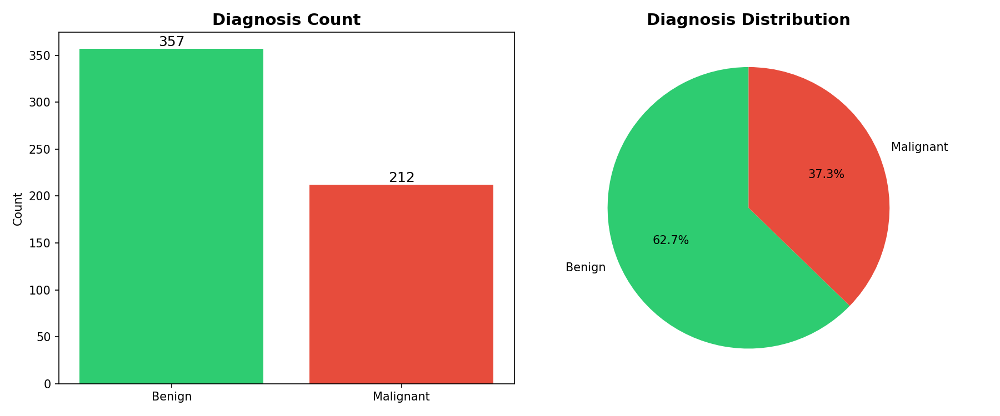

---

### 2. Correlation Heatmap — All 30 Features
- Strong multicollinearity exists — radius, perimeter, and area are highly correlated with each other (expected, as area = π × radius²)
- Concave points, concavity, and compactness cluster together
- Fractal dimension shows the weakest correlations across all features

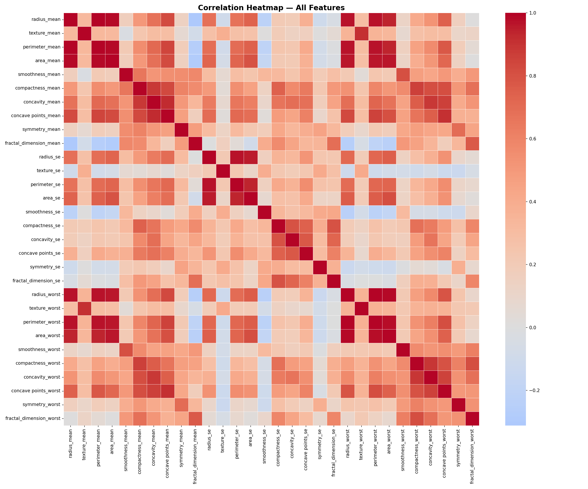

---

### 3. Top 10 Features Correlated with Diagnosis
- **`concave points_worst`** is the single strongest predictor at **0.79**
- **`perimeter_worst`**, **`concave points_mean`**, and **`radius_worst`** all at **0.78**
- **`radius_mean`** and **`area_worst`** at **0.73**
- **`fractal_dimension_mean`** (not shown) is the weakest predictor — near zero correlation

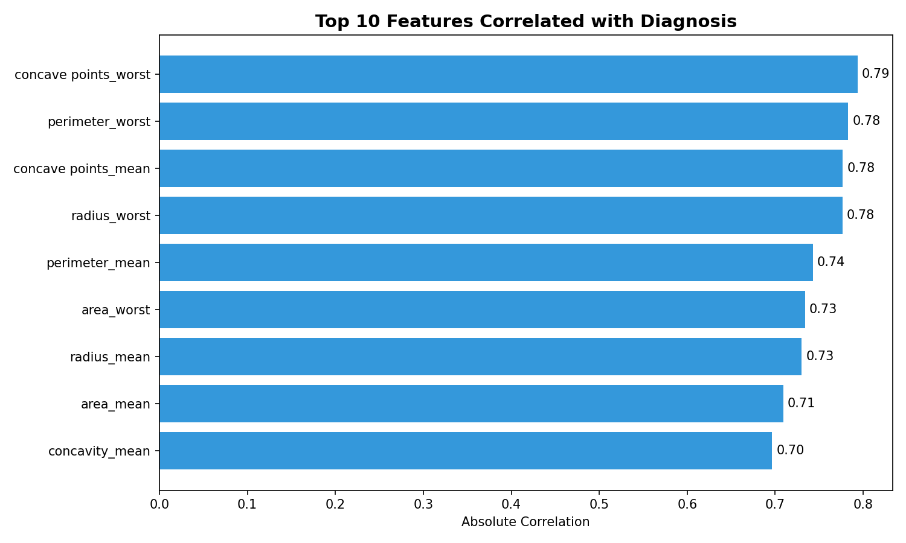

---

### 4. Mean Features — Benign vs Malignant (Box Plots)
- **Radius, perimeter, area** show the clearest separation — malignant tumors are significantly larger
- **Concave points and concavity** show dramatic differences — malignant tumors are far more irregular
- **Fractal dimension** shows almost no difference — overlapping boxes confirm it is not a useful predictor
- **Smoothness and symmetry** show moderate differences

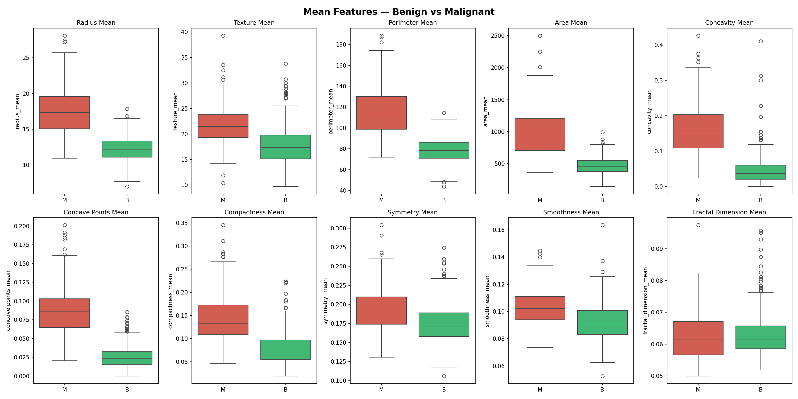

---

### 5. Worst Features — Benign vs Malignant (Box Plots)
- Worst features show even clearer separation than mean features — worst values amplify the differences
- **`concave points_worst`** is the most cleanly separated feature across both groups
- **`texture_worst`** is the only worst feature where benign values overlap significantly with malignant

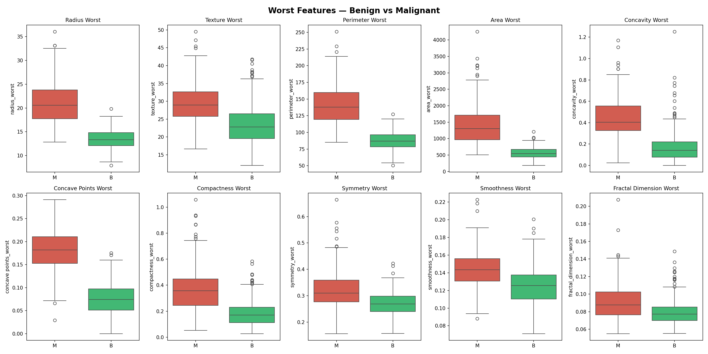

---

### 6. Feature Distributions — Histograms
- **Radius mean**: benign peaks at ~12, malignant peaks at ~18-20 — clear bimodal separation
- **Area mean**: benign tightly clustered under 1,000, malignant spreads from 500–2,500
- **Concavity mean**: benign heavily concentrated near 0, malignant spread across 0–0.4
- All four histograms confirm that benign distributions are narrower and lower-valued

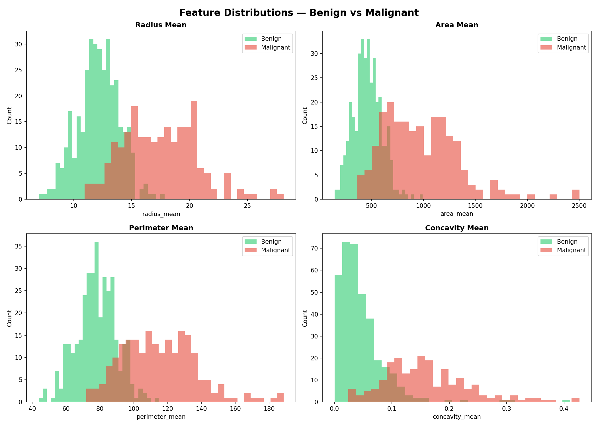

---

### 7. Violin Plots — Key Features
- **Radius**: malignant violin wider and higher — broader range of large tumors
- **Texture**: distributions overlap more than other features — texture alone is weaker predictor
- **Smoothness**: moderate separation — malignant slightly smoother on average
- **Concavity**: benign violin extremely thin near zero, malignant spread wide — strongest visual separation

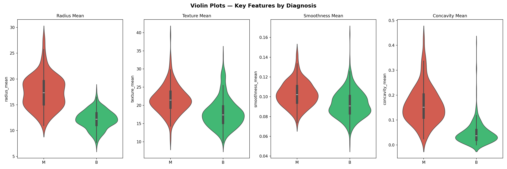

---

### 8. Scatter — Radius Mean vs Area Mean
- Near-perfect curved relationship (area ≈ π × radius²) visible in the scatter
- **Clear cluster separation**: benign (green) in lower-left, malignant (red) in upper-right
- Very little overlap between the two groups — these two features together are strong classifiers

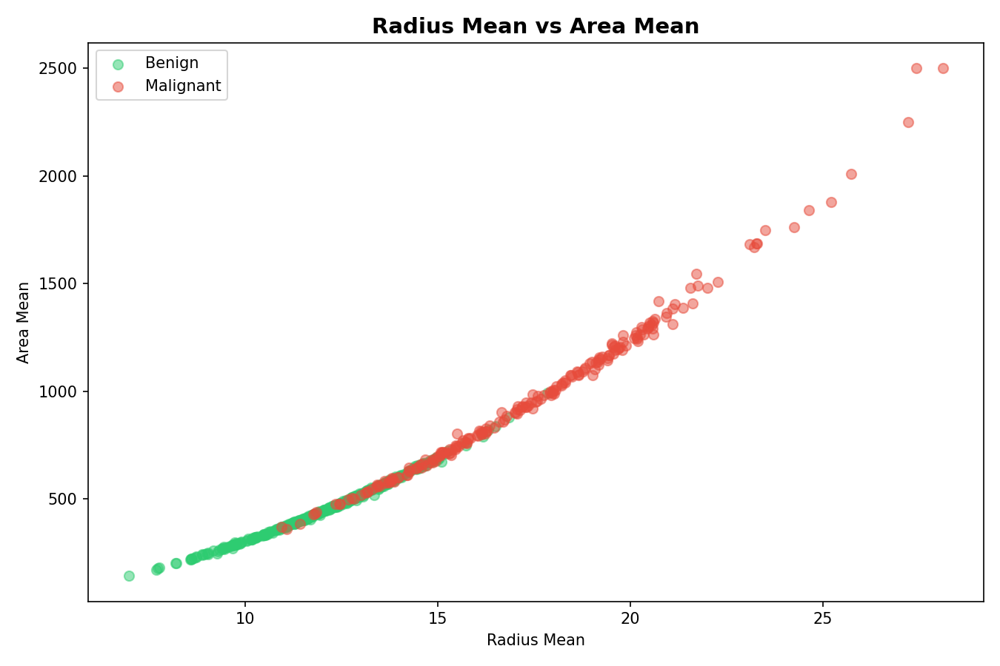

---

### 9. Pairplot — Top 5 Features
- The single most information-rich chart in this project
- **Diagonal KDE plots** show clear distribution separation for radius, perimeter, and area
- **Concavity vs concave points** scatter shows near-zero benign values vs spread malignant values
- Every feature combination shows some degree of separation — confirms the dataset is highly predictive

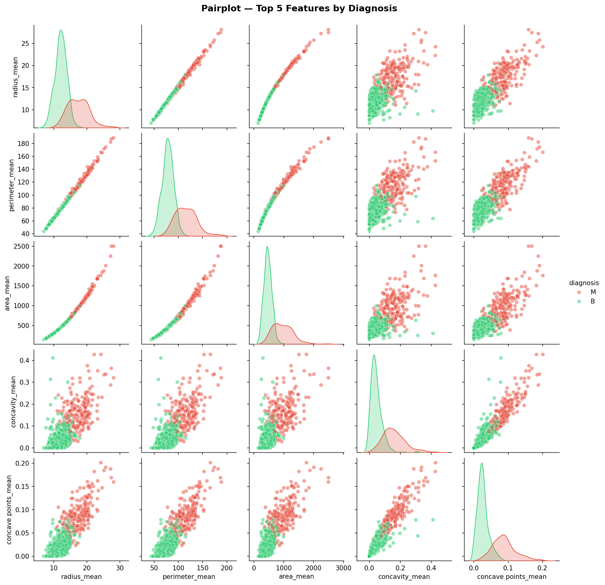

---

### 10. Radar Chart — Feature Profile
- **Malignant tumors extend outward** in nearly every dimension — larger, more irregular, more concave
- **Concave points** and **perimeter** show the biggest gap between M and B
- **Fractal dimension** is the only axis where both profiles nearly overlap
- **Symmetry** is the smallest non-zero difference — malignant tumors are marginally more asymmetric

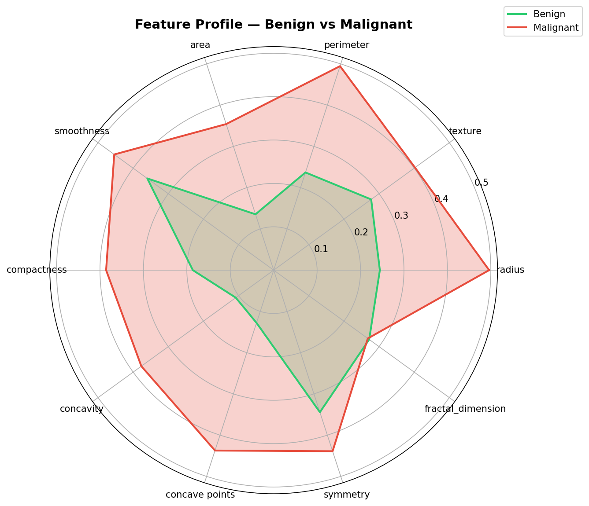

---

### 11. Worst Features — Correlation with Diagnosis
- `concave points_worst` leads at **0.79**, followed by `perimeter_worst` and `radius_worst` at **0.78**
- `fractal_dimension_worst` is weakest at **0.32** — consistent with mean features
- All worst features have higher correlations than their mean counterparts

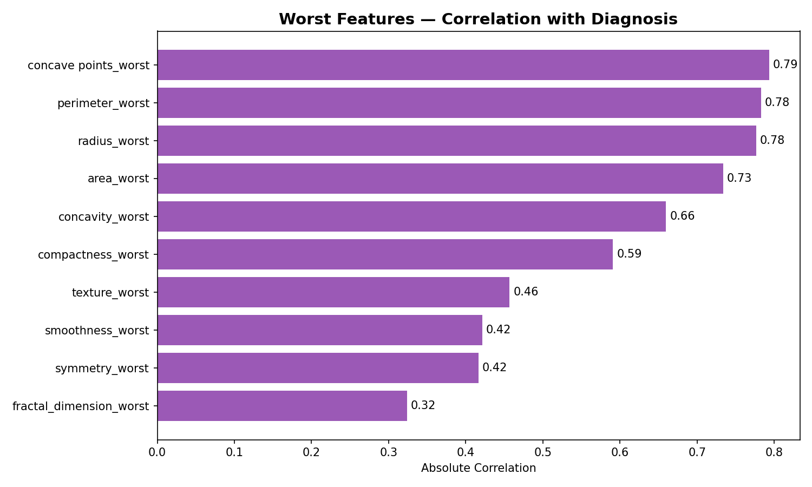

---

### 12. Feature Correlation — Mean vs SE vs Worst
- **Worst features** consistently outperform mean features in correlation with diagnosis
- **SE features** are the weakest predictors overall — radius_se is highest at ~0.57
- **`texture_se` and `symmetry_se`** are nearly useless as standalone predictors (~0.01)
- The pattern is clear: **worst > mean > SE** for predictive power

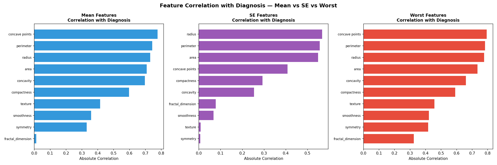

---

### 13. Swarm Plots — Top Predictive Features
- Every dot represents one patient — shows the full distribution with no information lost
- **`concave points_mean`**: malignant cluster sits entirely above benign cluster with minimal overlap
- **`perimeter_worst`**: clean separation — benign tightly packed under 120, malignant above 120
- **`radius_worst`**: similar pattern — very few overlapping data points between M and B

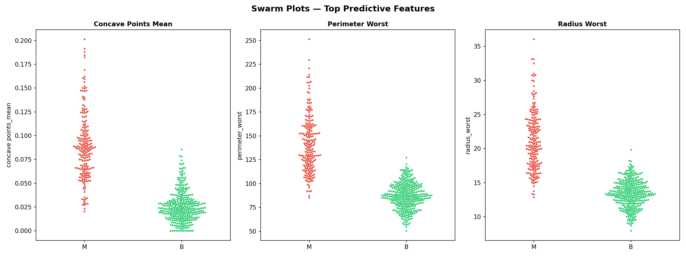

---

### 14. Top Worst Features — Distribution
- **Radius worst**: benign peaks sharply at ~13, malignant spreads from 15–35
- **Area worst**: benign tightly under 1,000, malignant extends to 4,000+
- **Concave points worst**: benign clusters at 0.05–0.10, malignant at 0.15–0.25

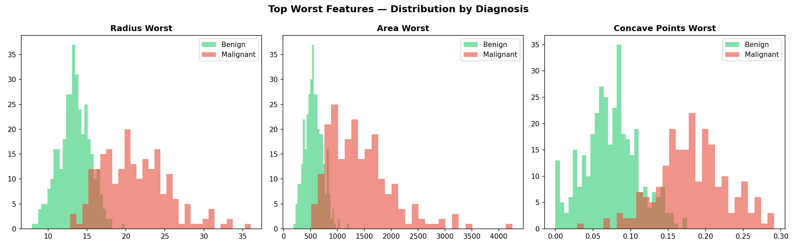

---

### 15. Mean vs Worst Comparison — All 10 Features
- For every feature, the worst value is significantly higher than the mean — especially in malignant tumors
- **Concavity and concave points** show the biggest amplification from mean to worst in malignant cases
- **Fractal dimension** is the only feature where mean and worst are nearly identical for both groups

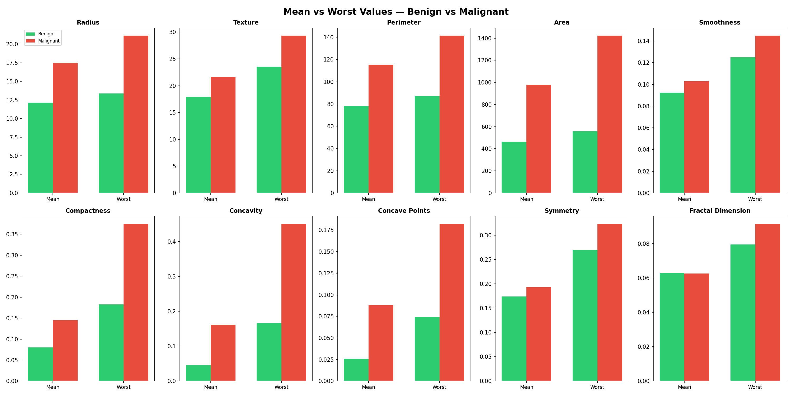

---

### 16. Outlier Analysis — Per Feature Per Diagnosis
- Malignant tumors have significantly more outliers across most features
- **Compactness and concavity** show the highest outlier counts in malignant cases
- High outlier counts in malignant tumors confirm their unpredictable, irregular behavior

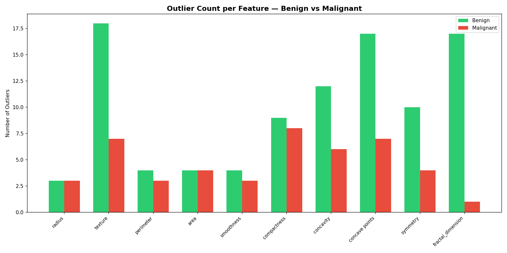

---

### 17. Cohen's d — Feature Separability Score
- **Concave points_mean** and **area_mean** score highest — strongest class separation
- Features with Cohen's d > 1.5 are considered to have a large effect size
- **Fractal dimension** scores near zero — statistically indistinguishable between M and B
- This chart directly answers which features a machine learning model should prioritize

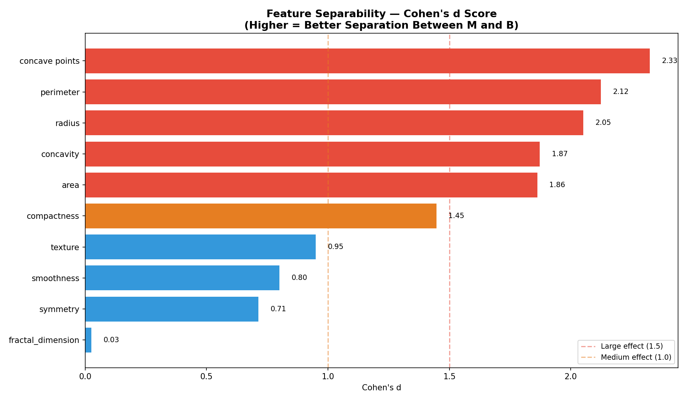

---

### 18. Diagnosis Composition by Feature Range
- Shows the tipping point — at what value does a feature transition from mostly benign to mostly malignant
- **Radius mean > ~15** — majority of cases become malignant
- **Concavity mean > ~0.10** — malignant cases dominate
- The dashed line at 50% marks the exact decision threshold for each feature

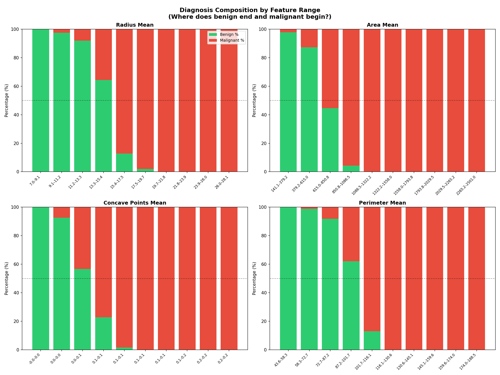

---

### 19. Cumulative Distribution — Top 4 Features
- The horizontal gap between the two CDF curves shows how separable the classes are
- **Concave points** — widest gap, strongest separator
- **Area mean** — 90% of benign cases fall below ~800, while 90% of malignant cases are above ~600
- The overlap zone visible in each chart is exactly what a machine learning classifier would learn to navigate

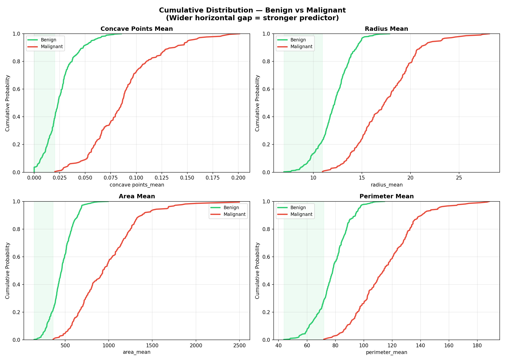

---

### 20. Tumor Fingerprint Heatmap — All 30 Features
- Complete diagnostic profile of both tumor types across all 30 features in a single view
- **Malignant row** is predominantly high values (red/orange) across mean and worst features
- **SE columns** show a mixed pattern — confirming they are weaker predictors
- **Fractal dimension** columns show nearly identical values for both rows

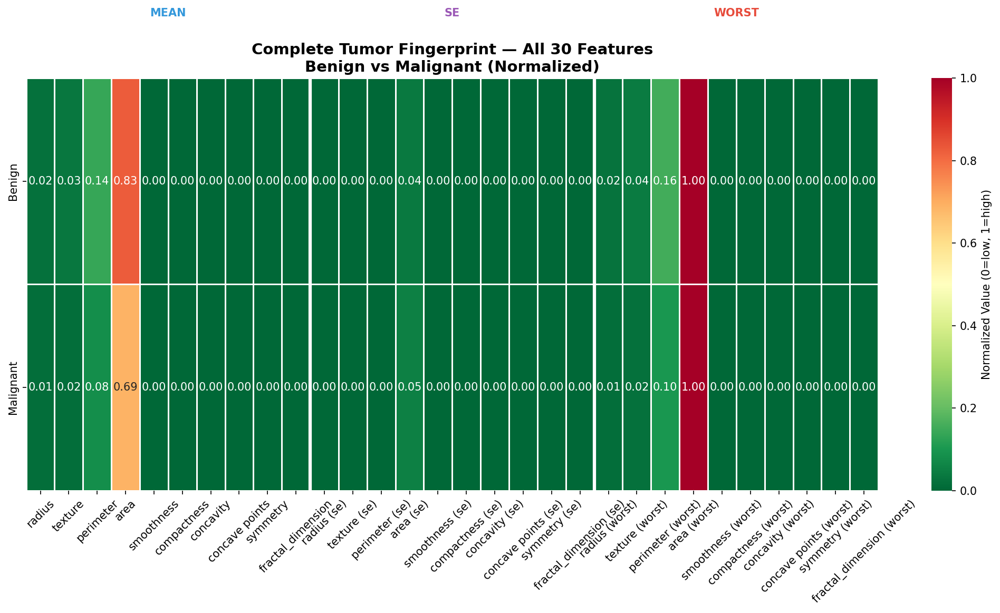

---

### 21. Bubble Chart — Concave Points vs Compactness
- Encodes 4 variables at once — x axis, y axis, color (diagnosis), and bubble size (area mean)
- Malignant bubbles are larger, higher, and further right — bigger, more compact, and more concave simultaneously
- Benign bubbles cluster tightly in the lower-left corner with small sizes

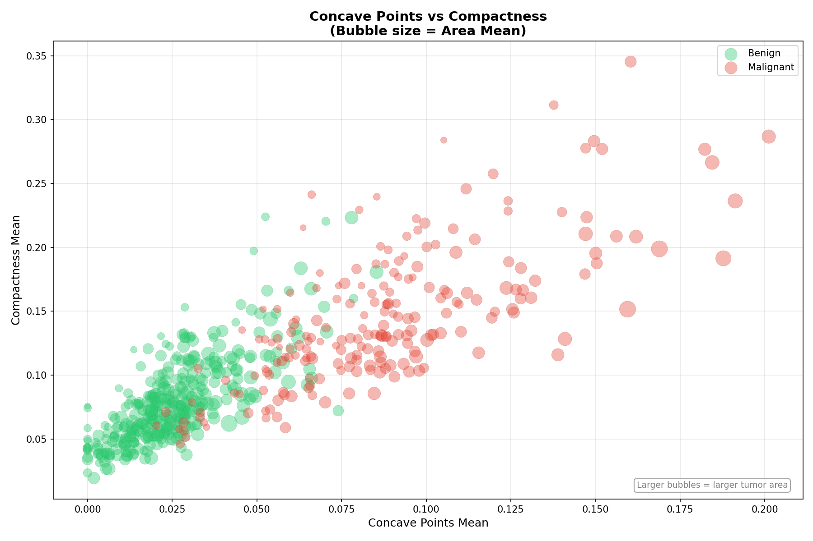

---

### 22. Strip Plot with Group Means — Top 6 Features
- Every dot represents one patient — no information hidden
- Bold mean line printed with exact value for instant readability
- **Concave points_mean** — malignant cluster sits entirely above benign with minimal overlap
- Shows both individual patient spread AND group average in one view

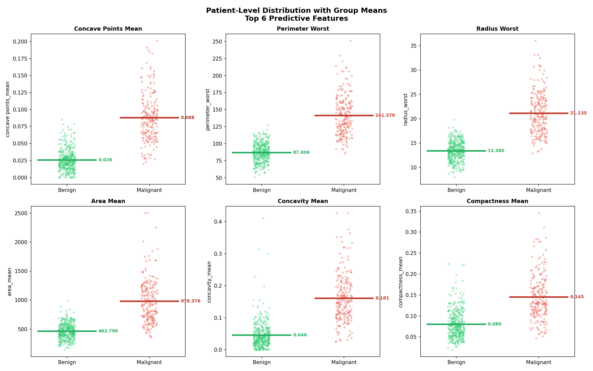

---

### 23. Summary Dashboard — 4 Key Insights
- Top 8 feature correlations, diagnosis distribution, normalized feature comparison, and category predictive power — all in one figure
- **Worst features average 0.6+ correlation** vs mean features at ~0.5 and SE features at ~0.2
- The perfect single chart to share as a project overview

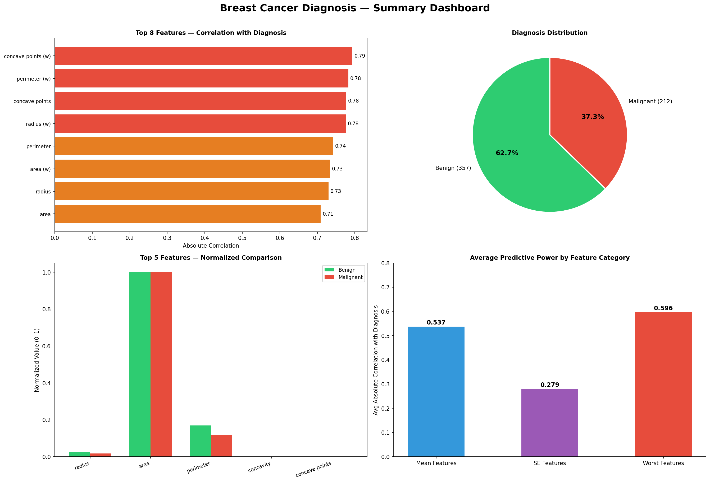

---

### 24. KDE Grid — All 10 Mean Features
- Full distribution shape for every mean feature in one grid
- **Concavity and concave points** — benign sharply peaked near zero, malignant spread wide
- **Fractal dimension** — the two curves nearly perfectly overlapping
- Dashed vertical lines mark each group's mean for instant comparison

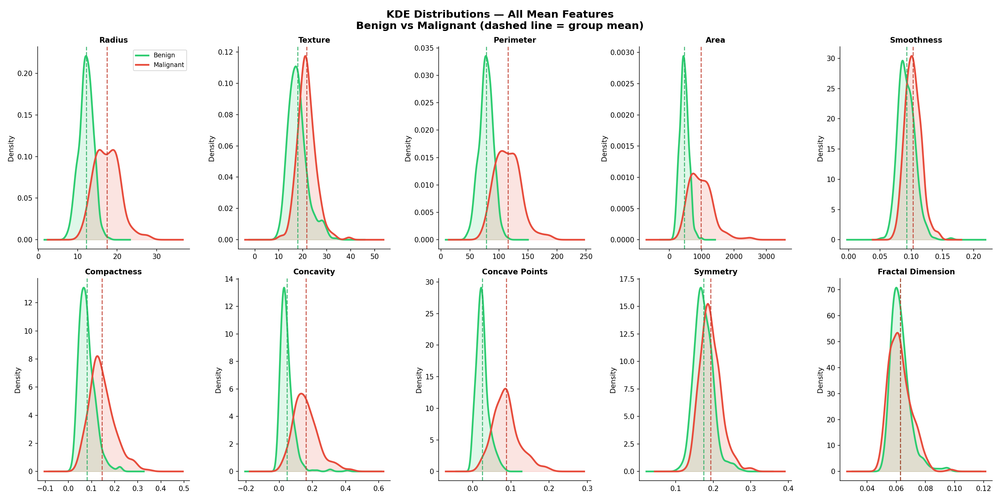

---

### 25. Diverging Bar Chart — % Difference Across All 30 Features
- Every single feature points right (red) — malignant is higher than benign across all 30 features without exception
- **Concavity and concave points** show 200–250% difference — the longest bars
- **Fractal dimension** near 0% — confirming it as the weakest predictor across all categories

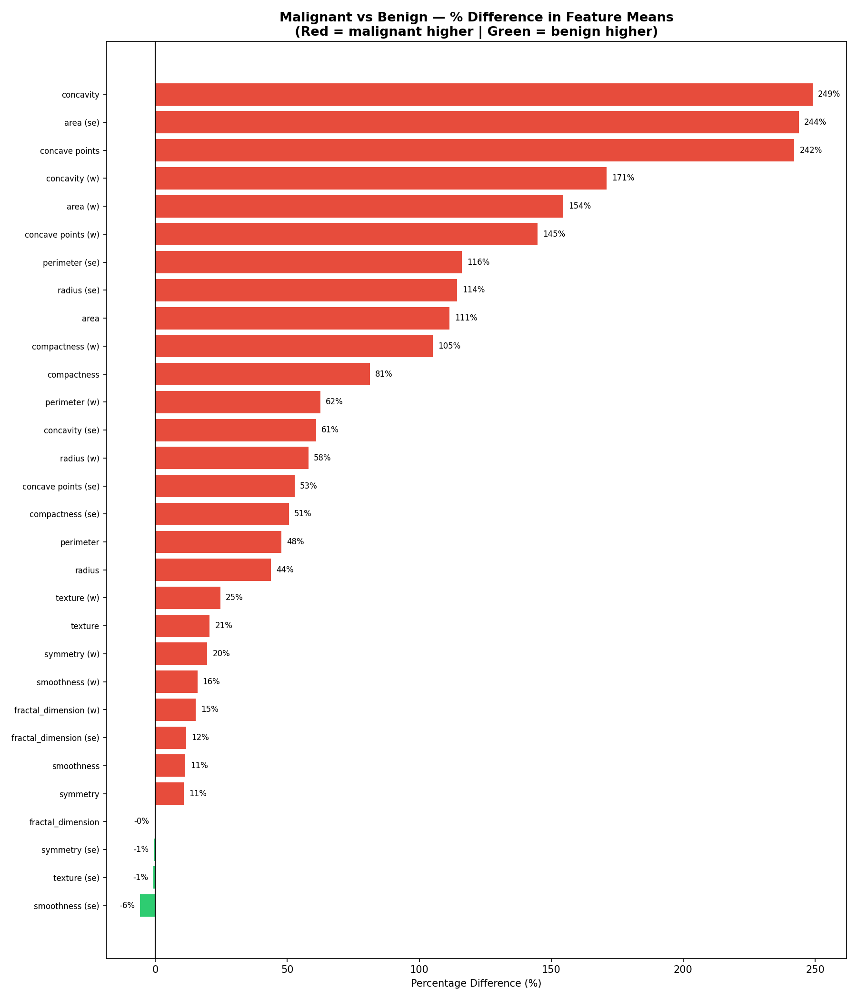

---

### 26. Threshold Exceedance — % of Patients Above Key Values
- Answers the most clinically practical question: if a measurement crosses a threshold, how likely is malignancy?
- **Concave points > 0.05** — ~90%+ of malignant vs ~10% of benign exceed this threshold
- **Area > 800** — majority of malignant cases exceed this, minority of benign
- The closest this EDA gets to a clinical decision support tool

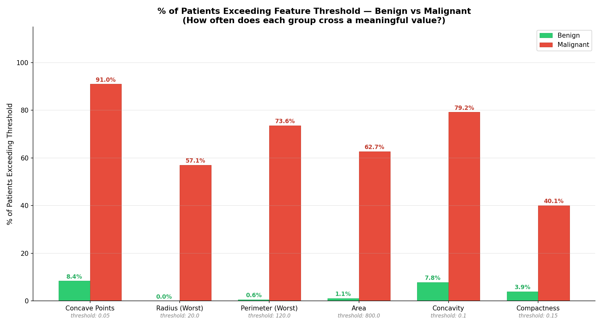

---

### 27. Ridgeline Plot — All Mean Features
- All 10 mean features stacked as density curves in a single scrollable view
- **Radius, area, perimeter** — two clearly separated humps, green left, red right
- **Fractal dimension** — the two curves nearly perfectly overlapping
- Most publication-worthy visual in the project

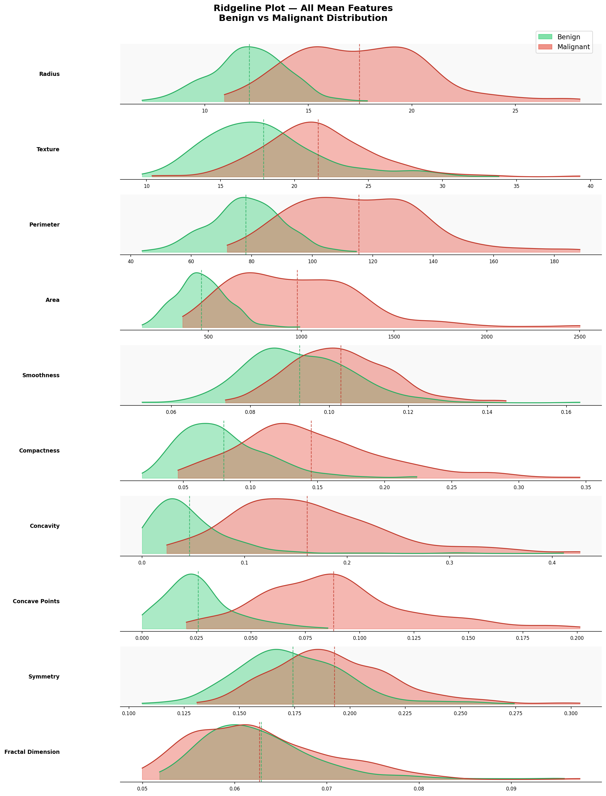

---

### 28. Decision Boundary Zone — Top 2 Predictors
- Annotated scatter plot showing where benign ends and malignant begins
- Shaded overlap zone marks where diagnosis is ambiguous
- "Mostly Benign" and "Mostly Malignant" zones labeled for non-data readers
- Bridges EDA and machine learning — visually shows where a classifier would draw the line

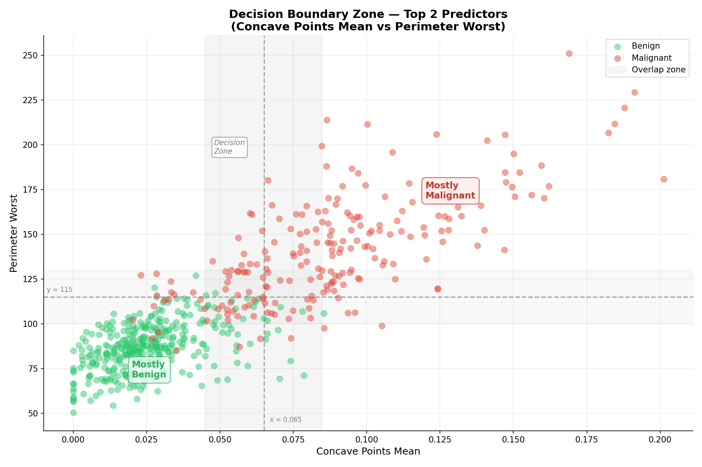

---

### 29. 3D Scatter — Top 3 Predictors
- Spatial view of cluster separation using concave points mean, radius worst, and perimeter worst
- Benign cluster tucked in the low corner, malignant spread across the high end of all three axes
- Available as both static PNG and rotating GIF

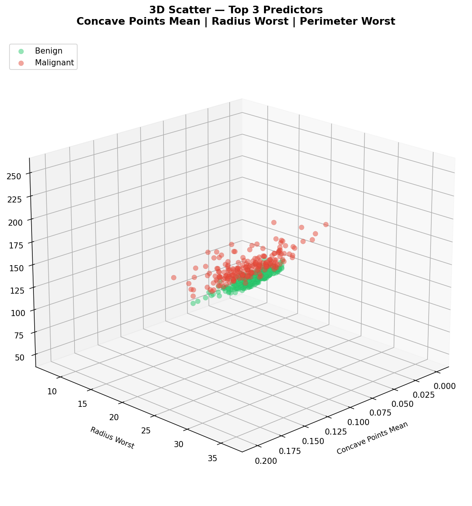

---

### 30. Top 10 Pairwise Correlation Heatmap
- Cleaner and more readable than the full 30-feature heatmap
- **Radius, perimeter, area** correlate above 0.95 with each other — near-perfect multicollinearity
- **Texture** shows the weakest correlations with all other features — carries independent information
- In a machine learning model, only a few representative features from each cluster would be needed

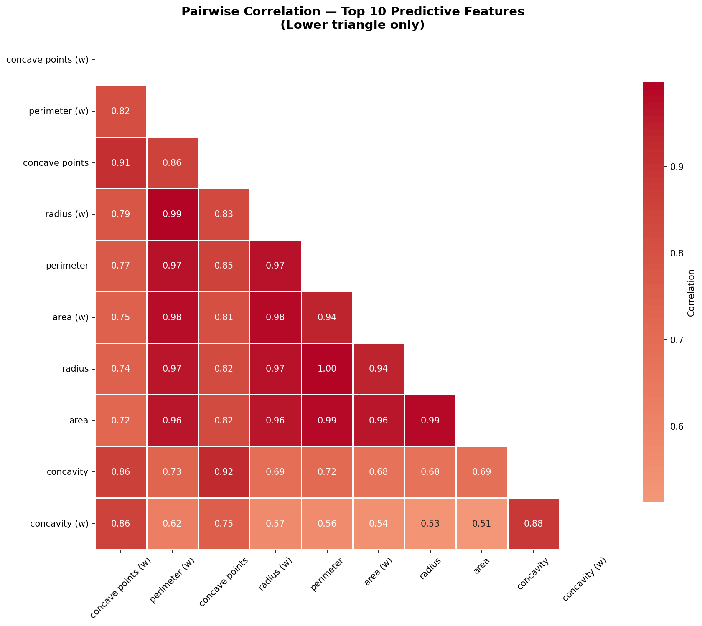

---

### 31. Worst to Mean Ratio — Per Feature Per Diagnosis
- Reveals how much more extreme malignant tumors get at their worst vs their average
- **Concavity and concave points** — malignant ratio much higher than benign
- **Fractal dimension** — ratio nearly identical for both groups
- Directly explains why worst features are stronger predictors than mean features

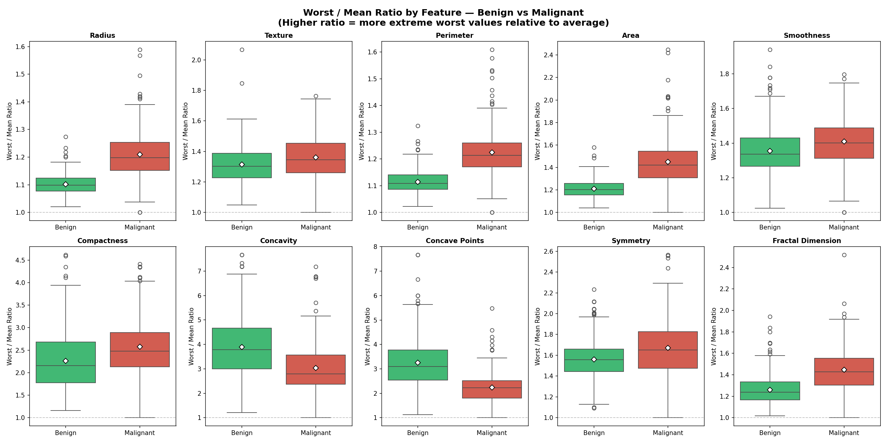

---

### 32. Bump Chart — Feature Ranking Across Categories
- Shows how each feature's predictive rank shifts from mean → SE → worst
- **Concave points** stays at rank 1 across all three categories
- **Texture** drops significantly in SE category
- **Fractal dimension** stays at rank 10 consistently — uniformly weak across all categories


---

### 33. Final Summary Table
- Complete color-coded reference card for all 10 mean features
- Columns: Benign Mean, Benign Std, Malignant Mean, Malignant Std, % Difference, Correlation
- Sorted by correlation — strongest predictors at top, weakest at bottom
- Row colors: red = strong predictor, yellow = moderate, green = weak

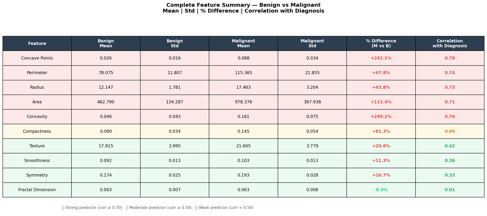

---

## 🧠 Key Medical Insights

1. **Size is the strongest indicator** — malignant tumors have significantly larger radius, perimeter, and area in both mean and worst measurements

2. **Shape irregularity matters** — concave points and concavity show the most dramatic differences between benign and malignant, with malignant tumors having far more irregular, concave contours

3. **Fractal dimension is the exception** — the only feature where benign (0.0629) and malignant (0.0627) are statistically identical, meaning boundary complexity alone cannot distinguish tumor type

4. **Worst features outperform mean features** — the extreme (worst) measurement of a sample is more diagnostic than the average measurement

5. **SE features are weak predictors** — variability of measurements within a sample adds little predictive value compared to the actual measurements themselves

6. **Malignant tumors are higher on every single feature** — the diverging bar chart confirms that malignant cases score higher than benign across all 30 features without a single exception

7. **The decision boundary is visible** — concave points mean > 0.065 and perimeter worst > 115 together create a clear separation zone between benign and malignant cases

8. **Multicollinearity is significant** — radius, perimeter, and area correlate above 0.95 with each other, meaning a machine learning model would not need all three

---

## 📊 Visualizations Summary

| # | Chart | Type | Key Insight |
|---|---|---|---|
| 1 | Diagnosis Distribution | Bar + Pie | 62.7% benign, 37.3% malignant |
| 2 | Correlation Heatmap | Heatmap | Strong multicollinearity in size features |
| 3 | Top 10 Correlations | Bar | concave points_worst leads at 0.79 |
| 4 | Mean Features | Box Plot | Clear size and shape separation |
| 5 | Worst Features | Box Plot | Even clearer than mean features |
| 6 | Key Distributions | Histogram | Bimodal separation visible |
| 7 | Violin Plots | Violin | Concavity shows strongest visual gap |
| 8 | Radius vs Area | Scatter | Near-perfect quadratic relationship |
| 9 | Pairplot Top 5 | Pairplot | Most information-rich single chart |
| 10 | Radar Chart | Radar | Complete tumor profile |
| 11 | Worst Correlations | Bar | Worst > mean in all features |
| 12 | Three Category Corr | Bar | Worst > mean > SE pattern |
| 13 | Swarm Plots | Swarm | Every patient visible, clear separation |
| 14 | Top Worst Dist | Histogram | Worst features extend much further |
| 15 | Mean vs Worst | Grouped Bar | Malignant amplifies more at worst |
| 16 | Outlier Analysis | Grouped Bar | Malignant has more outliers |
| 17 | Cohen's d | Bar | Quantified separability per feature |
| 18 | Feature Range | Stacked Bar | Tipping point per feature visible |
| 19 | CDF | Line | Horizontal gap = separability |
| 20 | Tumor Fingerprint | Heatmap | All 30 features in one view |
| 21 | Bubble Chart | Scatter | 4 variables encoded at once |
| 22 | Strip + Means | Strip | Individual patients + group average |
| 23 | Summary Dashboard | Multi-panel | 4 key insights in one figure |
| 24 | KDE Grid | KDE | All mean feature shapes at once |
| 25 | Diverging Bar | Bar | M higher than B on all 30 features |
| 26 | Threshold Chart | Grouped Bar | Clinical decision thresholds |
| 27 | Ridgeline Plot | Ridge | Publication-worthy stacked view |
| 28 | Decision Boundary | Scatter | Where benign ends, malignant begins |
| 29 | 3D Scatter + GIF | 3D | Spatial cluster separation |
| 30 | Top 10 Pairwise | Heatmap | Multicollinearity among top features |
| 31 | Worst/Mean Ratio | Box Plot | Why worst features predict better |
| 32 | Bump Chart | Bump | Rank shifts across categories |
| 33 | Final Summary Table | Table | Complete color-coded reference card |

---

## 🤖 Next Steps

> This dataset is a perfect candidate for a machine learning classification project. The EDA has identified the top predictive features — the next step is to build a logistic regression or random forest model to predict breast cancer diagnosis using `concave points_worst`, `perimeter_worst`, `radius_worst`, and `concave points_mean` as primary features.

---

## 🛠️ Tools Used

- Python 3.12
- pandas
- NumPy
- matplotlib
- seaborn
- scikit-learn (MinMaxScaler for normalization)
- scipy (gaussian_kde, Cohen's d)
- Pillow (rotating GIF animation)
- Jupyter Notebook

---

## 🚀 How to Run

1. Clone the repository
2. Install dependencies
```bash
pip install pandas numpy matplotlib seaborn scikit-learn scipy pillow jupyter
```
3. Open the notebook
```bash
jupyter notebook breast_cancer_eda.ipynb
```

---

## 📂 Dataset

- **Source:** [Kaggle — Breast Cancer Dataset by Wasiq Ali Yasir](https://www.kaggle.com/datasets/wasiqaliyasir/breast-cancer-dataset/data)
- **Original Source:** University of Wisconsin — Breast Cancer Wisconsin (Diagnostic) Data Set
- **Records:** 569 breast mass samples
- **Type:** Real medical data from digitized FNA images

---

## 👤 Author

**NIO**
Third exploratory data analysis portfolio project — first project on real medical data, focused on feature analysis for breast cancer diagnosis classification with 33 visualizations across 12 chart types
