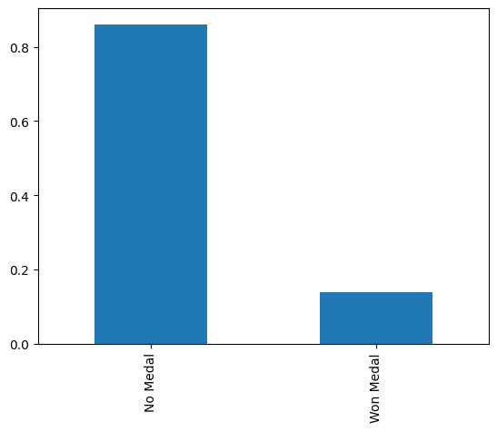
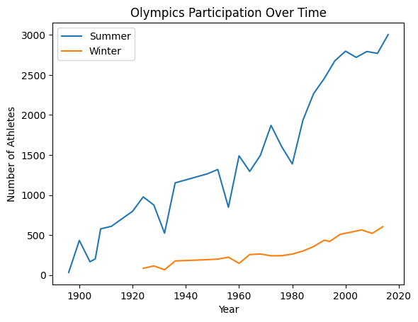
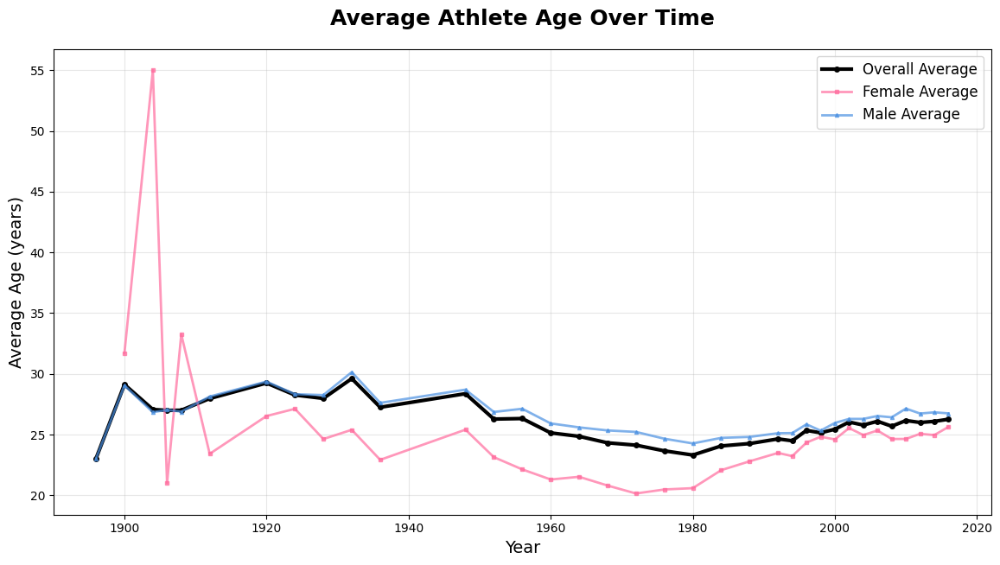
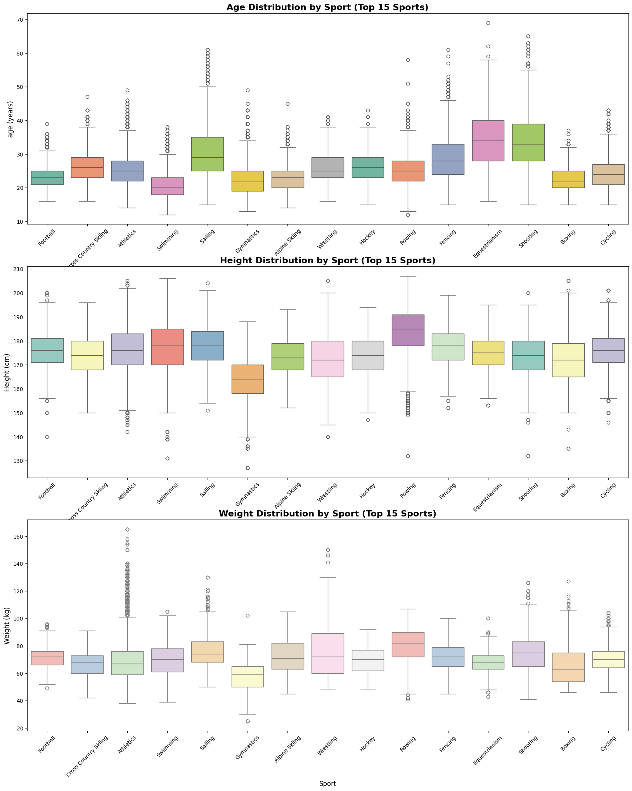

# 🏅 Olympic Games — Exploratory Data Analysis Project

An exploratory data analysis project using Python, pandas, matplotlib, and seaborn on 120+ years of Olympic athlete and event data. The dataset contains 70,000 athlete-event records spanning from 1896 to 2016, covering both Summer and Winter Olympics with detailed athlete demographics, event information, and medal outcomes.

---

## 📁 Project Structure

```
Olympics_EDA/
│
├── data/
│   └── olympic_data.csv              # main dataset (70,000 records)
│
├── visualizations/
│   ├── No_Medal_.png                 # medal vs no medal distribution
│   ├── 20200-.png                    # participation over time
│   ├── age_over_time.png             # average age trends by gender
│   ├── gender_participation_time.png # gender participation evolution
│   └── sport_distributions.png       # age/height/weight by sport
│
└── olympic_eda.ipynb                 # EDA notebook
```

---

## 📊 Dataset Overview

| Property | Detail |
|---|---|
| Rows | 70,000 (after removing 383 duplicates) |
| Columns | 15 |
| Source | Kaggle - Olympic Data by Bhanu Pratap Biswas |
| Time Span | 1896 - 2016 (120 years) |
| Olympics Covered | 35 Olympic Games (Summer & Winter) |

### Columns

| Column | Description | Null Count |
|---|---|---|
| `ID` | Unique athlete identifier | 0 |
| `Name` | Athlete's full name | 0 |
| `Sex` | Gender (M/F) | 0 |
| `Age` | Age at time of competition | 2,732 (4%) |
| `Height` | Height in centimeters | 16,254 (23%) |
| `Weight` | Weight in kilograms | 17,101 (24%) |
| `Team` | Team/country name | 0 |
| `NOC` | National Olympic Committee code | 0 |
| `Games` | Year and season (e.g., "2016 Summer") | 0 |
| `Year` | Year of the Olympics | 0 |
| `Season` | Summer or Winter | 0 |
| `City` | Host city | 0 |
| `Sport` | Sport category | 0 |
| `Event` | Specific event name | 0 |
| `Medal` | Medal type (Gold/Silver/Bronze) or NaN | 60,310 (86%) |

---

## 🔍 Initial Findings

| Finding | Detail |
|---|---|
| Duplicate records | 383 duplicate rows removed |
| Medal distribution | 86% of athletes never won a medal (60,310 / 70,000) |
| Missing physical data | Height and Weight missing for ~23-24% of records |
| Age data quality | Only 4% missing age data — relatively complete |
| Gender representation | Male-dominated historically, but female participation growing rapidly |
| Data structure | Each row = one athlete's participation in one event |

---

## 📈 Key Insights & Analysis

### 1. **Medal Distribution**
- **86.2%** of athlete-event records resulted in **no medal**
- **13.8%** won a medal (Gold, Silver, or Bronze)
- This is realistic — most Olympic participants don't medal



---

### 2. **Participation Growth Over Time**

**Summer Olympics:**
- Started with ~200 athletes in 1896
- Grew to nearly 3,000 athletes by 2016
- Sharp increase post-1980s
- Notable dips during WWI (1916 cancelled) and WWII (1940, 1944 cancelled)

**Winter Olympics:**
- Consistently smaller than Summer Games
- Steady growth from ~100 athletes (1924) to ~600 athletes (2014)
- More stable participation numbers



---

### 3. **Gender Demographics**

**Age Differences:**
| Gender | Average Age |
|---|---|
| Female | 23.7 years |
| Male | 26.2 years |

**Height Differences:**
| Gender | Average Height |
|---|---|
| Female | 167.9 cm |
| Male | 178.8 cm |

**Key Findings:**
- Female athletes are on average **2.5 years younger** than male athletes
- Male athletes are on average **10.9 cm taller** than female athletes
- Gender gap has been narrowing in recent decades

---

### 4. **Age Trends Over Time**

**Historical Patterns:**
- **Early 1900s:** Highly variable age averages (data quality issues, small sample sizes)
- **Female athletes in 1904:** Average age spiked to **55 years** (outlier due to very few female participants)
- **1920s-1940s:** Male athletes averaged ~28 years, females ~24-27 years
- **1950s-1980s:** Female athlete age dropped to **~21 years** (youngest period)
- **1980s-Present:** Both genders converging toward **~25-26 years**
- **Overall trend:** Age differences between genders narrowing over time



---

### 5. **Gender Participation Evolution**

**Historical Milestones:**
- **1896-1920s:** Olympics were almost exclusively male
- **1920s-1960s:** Slow, gradual increase in female participation
- **1970s-1980s:** Female participation begins accelerating
- **1990s-2016:** Rapid growth in female athletes
- **2016:** Female athletes represent approximately **~40%** of all participants

**Key Insight:** The stacked area chart shows the Olympics transforming from a male-only event to an increasingly gender-balanced competition.


---

### 6. **Physical Attributes by Sport**

**Age Patterns:**
- **Youngest sports:** Gymnastics, Swimming (~20-23 years median)
- **Oldest sports:** Sailing, Shooting, Equestrian (~30-35+ years median)
- **Wide age ranges:** Some sports (Shooting, Sailing) have participants from teens to 60+

**Height Patterns:**
- **Tallest sports:** Rowing, Basketball (~185-190 cm median)
- **Shortest sports:** Gymnastics (~160 cm median)
- **Most variation:** Sports like Athletics show wide height ranges due to diverse events

**Weight Patterns:**
- **Heaviest sports:** Rowing, Wrestling (heavier weight classes), Weightlifting (~80-90 kg median)
- **Lightest sports:** Gymnastics (~55-65 kg median)
- **Clear sport-specific requirements:** Each sport has distinct physical profiles



---

### 7. **Medal Winners vs Non-Medalists**

**Physical Comparison:**
| Category | Average Height |
|---|---|
| No Medal | 175.1 cm |
| Won Medal | 177.8 cm |

**Key Finding:**
- Medal winners are on average **2.7 cm taller** than non-medalists
- This suggests a slight height advantage, though correlation ≠ causation
- Sport-specific analysis would provide more nuanced insights

---

## 🧹 Data Cleaning Steps

### 1. Removed Duplicates
- Identified and removed **383 duplicate records**
- Ensured each athlete-event combination appears only once

```python
df.drop_duplicates(inplace=True)
```

### 2. Handled Missing Values
- **Age:** 4% missing — relatively complete
- **Height/Weight:** 23-24% missing — likely systematic (older Olympics, certain sports)
- **Medal:** 86% missing (NaN) — this is expected (most athletes don't medal)

**Decision:** Kept missing values as-is for now; would require further investigation to determine if missing data is:
- Random (MCAR)
- Related to specific years/sports (MAR)
- Systematically biased (NMAR)

---

## 📊 Visualizations Created

| Visualization | Type | Insight |
|---|---|---|
| Medal Distribution | Bar Chart | 86% no medal, 14% medaled |
| Participation Over Time | Line Chart | Exponential growth, especially post-1980s |
| Age Over Time | Multi-Line Chart | Age convergence between genders |
| Gender Participation | Stacked Area Chart | Dramatic increase in female athletes |
| Sport Distributions | Box Plots | Physical requirements vary significantly by sport |

---

## 🛠️ Tools Used

- Python 3.12
- pandas
- NumPy
- matplotlib
- seaborn
- Jupyter Notebook

---

## 🚀 How to Run

1. Clone the repository
2. Install dependencies
```bash
pip install pandas numpy matplotlib seaborn jupyter
```
3. Open the notebook
```bash
jupyter notebook olympic_eda.ipynb
```

---

## 📂 Dataset

- **Source:** [Kaggle — Olympic Data by Bhanu Pratap Biswas](https://www.kaggle.com/datasets/bhanupratapbiswas/olympic-data)
- **Coverage:** 120 years of Olympic history (1896-2016)
- **Records:** 70,000 athlete-event entries


## 👤 Author

**NIO**  
First exploratory data analysis portfolio project — stepping into EDA after completing 3 data cleaning projects

---

## 📝 Notes

This project represents the transition from data cleaning to exploratory analysis. The dataset was already relatively clean, allowing focus on visualization, pattern recognition, and insight generation rather than extensive preprocessing.
