# 🎵 Spotify User Churn — Exploratory Data Analysis

An exploratory data analysis project using Python, pandas, matplotlib, and seaborn on a Spotify user dataset built for churn analysis. The dataset contains 8,000 user records with behavioral, demographic, and subscription data — with a target variable `is_churned` that drives the entire analysis.

---

## 📁 Project Structure

```
Spotify_Churn_EDA/
│
├── data/
│   └── spotify_churn.csv                     # main dataset (8,000 records)
│
├── visualizations/
│   ├── churn_by_subscription.png             # churn rate by subscription type
│   ├── churn_by_country.png                  # churn rate by country
│   ├── churn_by_gender.png                   # churn rate by gender
│   ├── churn_by_device.png                   # churn rate by device type
│   ├── churn_by_age_group.png                # churn rate by age group
│   ├── listening_time_dist.png               # listening time distribution
│   ├── listening_time_age_group.png          # avg listening time by age group
│   ├── songs_per_day_churn.png               # songs played — churned vs active
│   ├── skip_rate_churn.png                   # skip rate — churned vs active
│   ├── offline_listening_churn.png           # offline listening usage
│   ├── ads_churn.png                         # ads per week — churned vs active
│   ├── ads_subscription.png                  # ads per week by subscription
│   ├── age_dist_churn.png                    # age distribution by churn
│   ├── subscription_dist.png                 # subscription type distribution
│   ├── correlation_heatmap.png               # numeric feature correlations
│   ├── skip_vs_listening_scatter.png         # skip rate vs listening time
│   └── songs_vs_listening_scatter.png        # songs played vs listening time
│
└── spotify_churn_eda.ipynb                   # EDA notebook
```

---

## 📊 Dataset Overview

| Property | Detail |
|---|---|
| Rows | 8,000 |
| Columns | 12 |
| Target Variable | `is_churned` (0 = Active, 1 = Churned) |
| Overall Churn Rate | ~25.9% |
| Subscription Types | Free, Premium, Family, Student |
| Devices | Mobile, Desktop, Web |
| Countries | 8 (US, UK, CA, IN, AU, DE, FR, PK) |

### Columns

| Column | Description |
|---|---|
| `user_id` | Unique identifier for each user |
| `gender` | User gender (Male / Female / Other) |
| `age` | User age |
| `country` | User location |
| `subscription_type` | Type of subscription (Free, Premium, Family, Student) |
| `listening_time` | Minutes spent listening per day |
| `songs_played_per_day` | Number of songs played daily |
| `skip_rate` | Percentage of songs skipped |
| `device_type` | Device used (Mobile, Desktop, Web) |
| `ads_listened_per_week` | Number of ads heard per week |
| `offline_listening` | Whether user uses offline mode (0/1) |
| `is_churned` | Target variable — 0 = Active, 1 = Churned |

---

## 🔍 Key Findings

### Churn Overview
| Segment | Churn Rate |
|---|---|
| Overall | ~25.9% |
| Family plan | 27.5% (highest) |
| Free plan | 24.9% (lowest) |
| Mobile users | 26.9% |
| Web users | 25.0% |
| Age group 26-35 | 27.6% (highest) |
| Age group 18-25 | 24.7% (lowest) |

---

## 📈 Analysis & Insights

### 1. Churn Rate by Subscription Type
- **Family plan** has the highest churn at **27.5%**
- **Free plan** has the lowest churn at **24.9%** — surprising, as paid users churn more
- Churn rates are relatively close across all subscription types (24.9% – 27.5%)

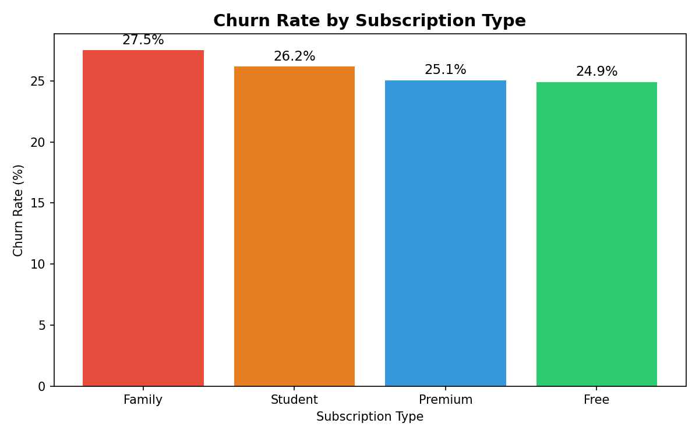

---

### 2. Churn Rate by Country
- **Pakistan (PK)** leads with **27.5%** churn
- **India (IN)** has the lowest churn at **24.3%**
- All countries fall within a narrow 3% range — no single country stands out dramatically

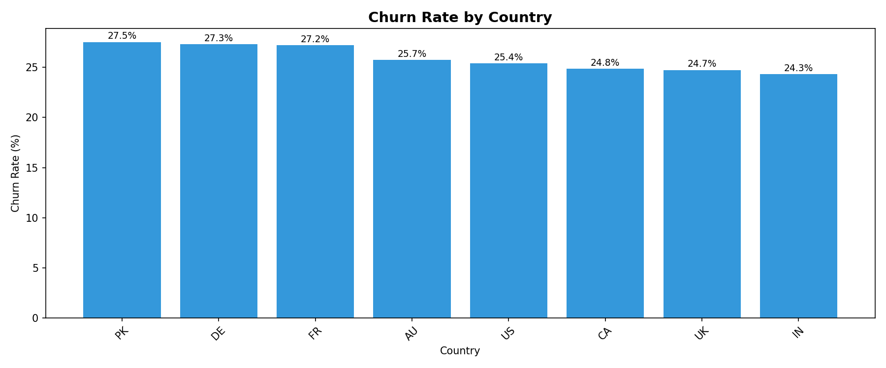

---

### 3. Churn Rate by Gender
- All genders have nearly identical churn rates (~25-26%)
- **Female** users churn slightly more at **26.3%**
- **Gender is not a significant predictor of churn** in this dataset

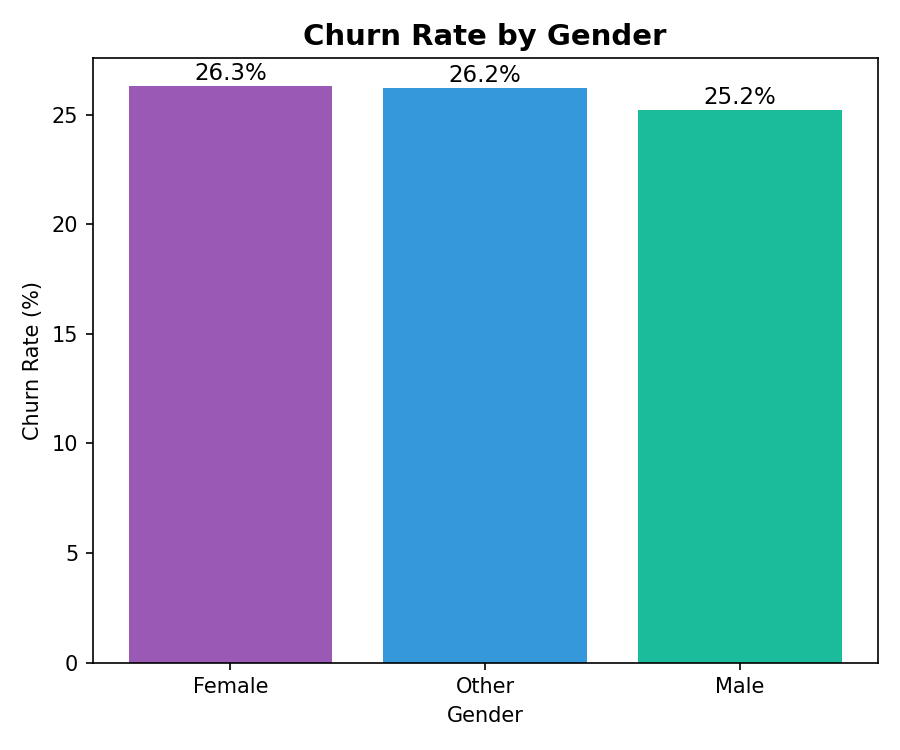

---

### 4. Churn Rate by Device Type
- **Mobile** users churn the most at **26.9%**
- **Web** users churn the least at **25.0%**
- Device type shows only minor differences in churn behavior

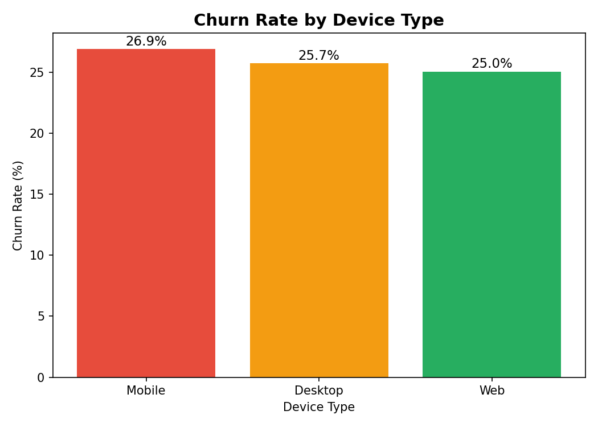

---

### 5. Listening Time Distribution
- Both churned and active users show near-identical listening time distributions
- Listening time is **uniformly distributed** between 0–300 mins/day for both groups
- **Listening time alone does not predict churn**

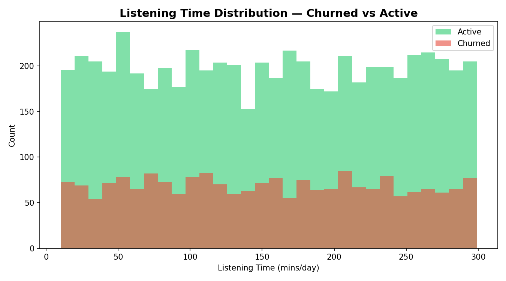

---

### 6. Skip Rate — Churned vs Active
- Churned users have a **slightly higher median skip rate** (~0.31) vs active users (~0.30)
- The difference is minimal — skip rate is not a strong churn predictor in this dataset
- Wide IQR for both groups suggests high variability across users

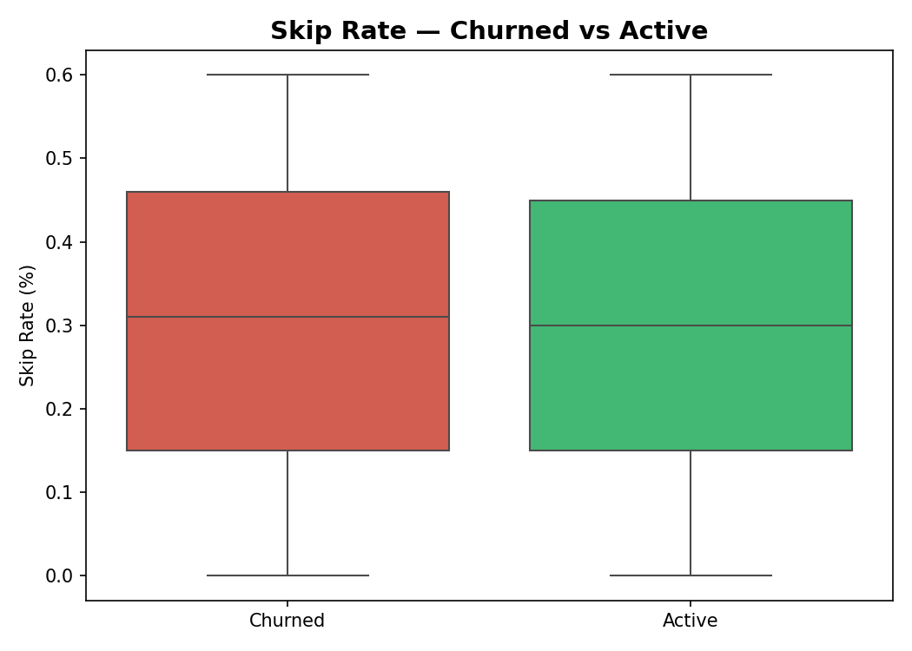

---

### 7. Offline Listening Usage
- Users who use offline listening **(offline = 1)** are significantly more represented in active users
- Active users: ~4,400 use offline vs ~1,500 who don't
- Churned users: nearly equal split between offline and non-offline users
- **Offline listening appears to be linked to higher retention**

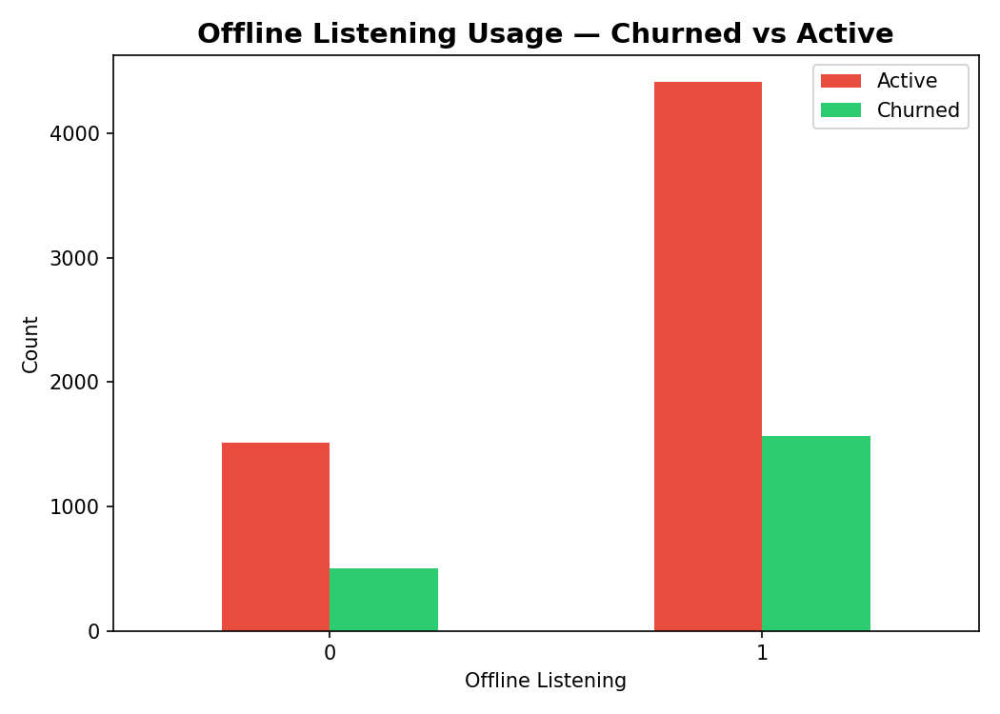

---

### 8. Ads Per Week by Subscription — Data Validation ✅
- **Free users** average **27.5 ads/week**
- **Family, Premium, Student** users average **0.0 ads/week**
- This confirms the dataset is internally consistent — paid users correctly have no ads

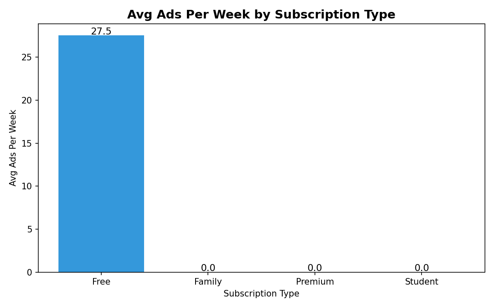

---

### 9. Churn Rate by Age Group
- **26–35** age group has the highest churn at **27.6%**
- **18–25** has the lowest at **24.7%**
- Age group differences are small — age is not a strong standalone churn predictor

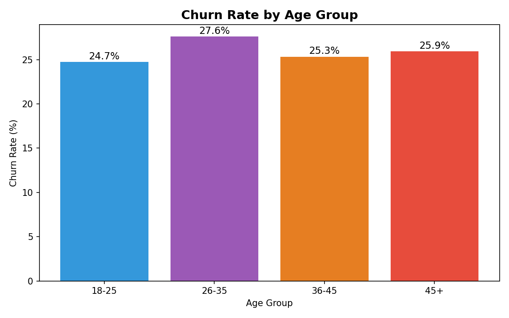

---

### 10. Correlation Heatmap
- **No strong correlations** exist between any numeric features and `is_churned`
- The highest correlation with churn is `skip_rate` at just **0.02**
- This suggests churn in this dataset is driven by **categorical or behavioral patterns** not captured by simple numeric correlations

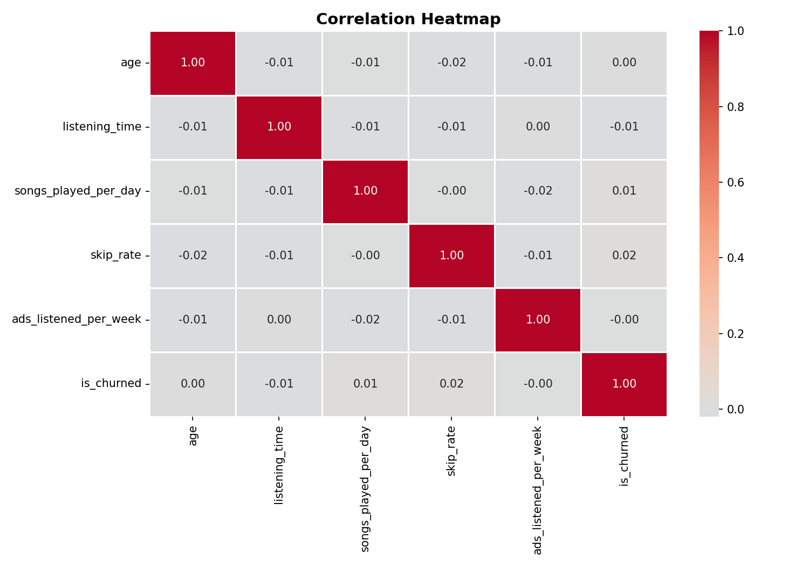

---

### 11. Subscription Type Distribution
- **Premium** has the most users at **2,115**
- **Family** has the fewest at **1,908**
- Distribution is nearly equal across all four subscription types — well-balanced dataset

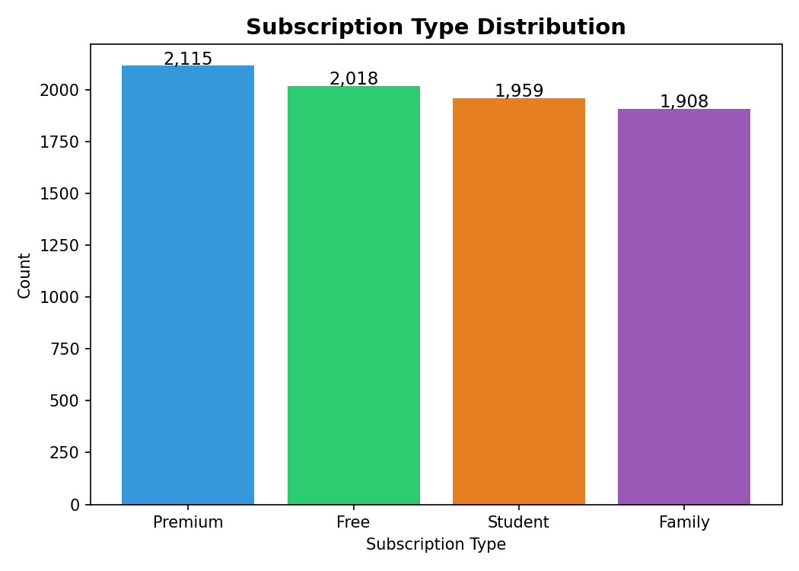

---

## 📊 Visualizations Summary

| Chart | Type | Key Insight |
|---|---|---|
| Churn by Subscription | Bar | Family plan churns most unexpectedly |
| Churn by Country | Bar | PK highest, IN lowest — narrow range |
| Churn by Gender | Bar | Gender not a churn predictor |
| Churn by Device | Bar | Mobile users churn slightly more |
| Churn by Age Group | Bar | 26-35 highest churn group |
| Listening Time Distribution | Histogram Overlay | No difference between churned/active |
| Skip Rate — Churn | Box Plot | Minimal difference |
| Offline Listening | Grouped Bar | Offline users more likely to stay |
| Ads by Subscription | Bar | Data validation — paid = 0 ads ✅ |
| Correlation Heatmap | Heatmap | No strong numeric predictors of churn |
| Skip vs Listening Time | Scatter | No clear pattern by churn status |
| Songs vs Listening Time | Scatter | No separation by subscription type |

---

## 🛠️ Tools Used

- Python 3.12
- pandas
- NumPy
- matplotlib
- seaborn
- Jupyter Notebook

---

## 🚀 How to Run

1. Clone the repository
2. Install dependencies
```bash
pip install pandas numpy matplotlib seaborn jupyter
```
3. Open the notebook
```bash
jupyter notebook spotify_churn_eda.ipynb
```

---

## 📂 Dataset

- **Source:** [Kaggle — Spotify Dataset for Churn Analysis by Nabiha Zahid](https://www.kaggle.com/datasets/nabihazahid/spotify-dataset-for-churn-analysis/data)
- **Records:** 8,000 users
- **Type:** Synthetic dataset designed for churn analysis practice

---

## 👤 Author

**NIO**
Second exploratory data analysis portfolio project — focused on churn behavior and user retention patterns
