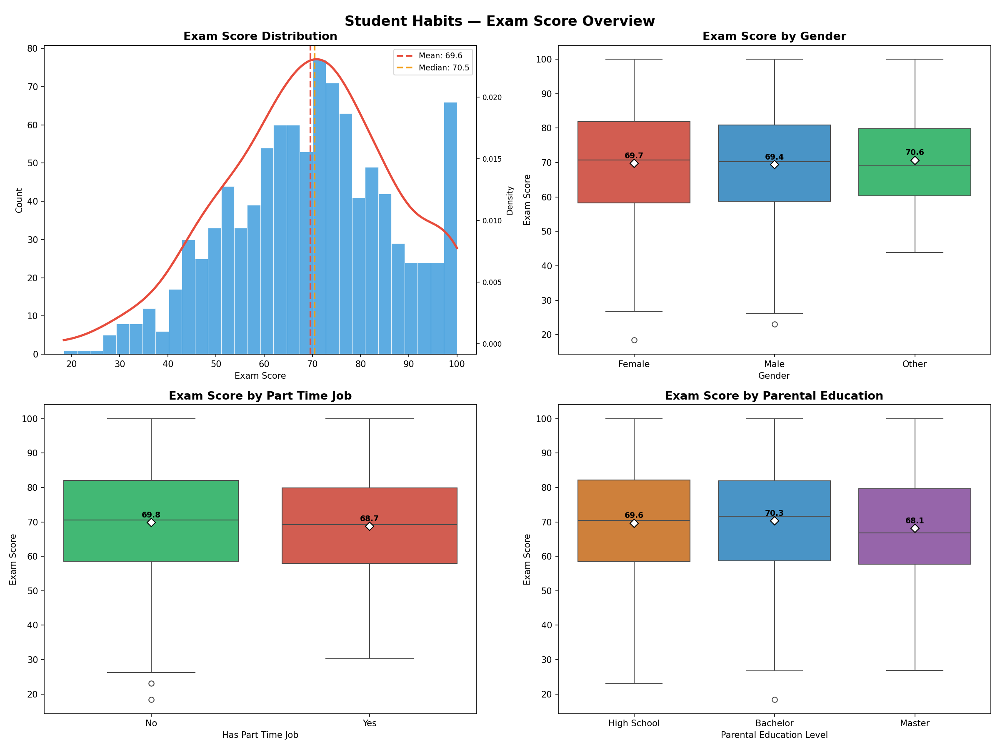
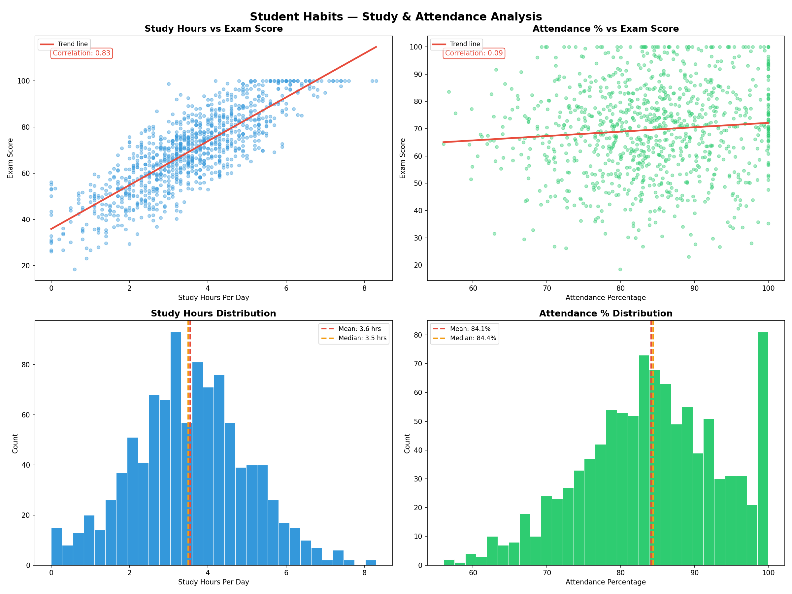
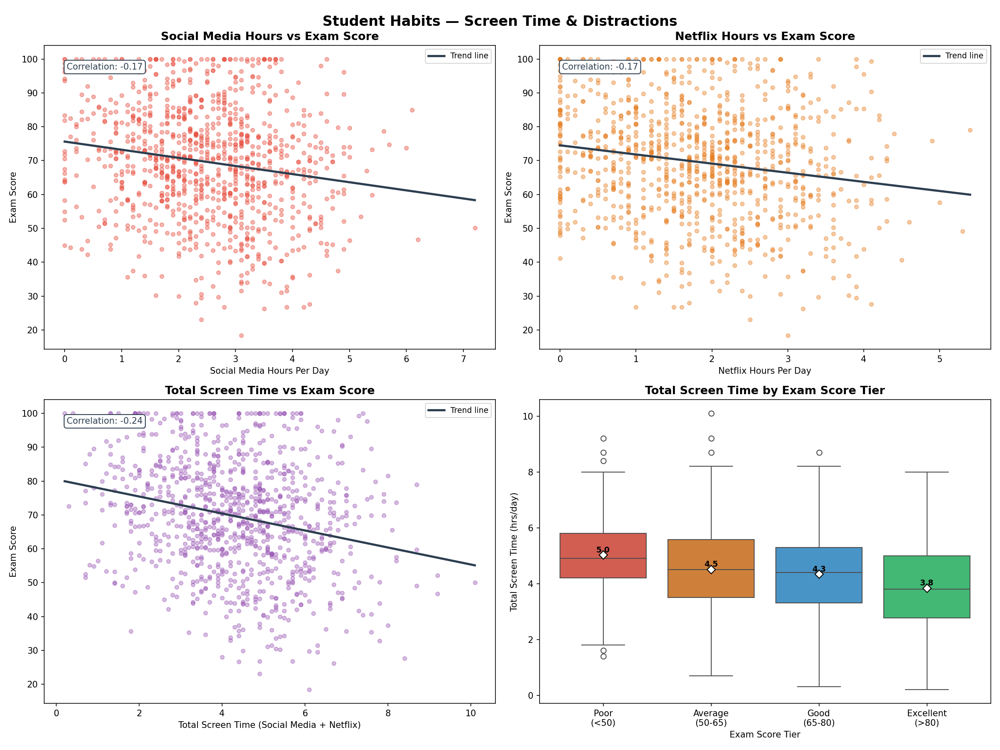
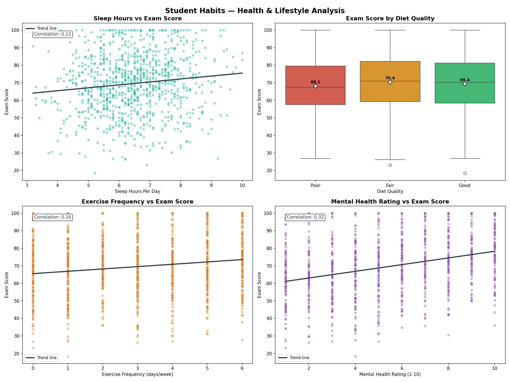
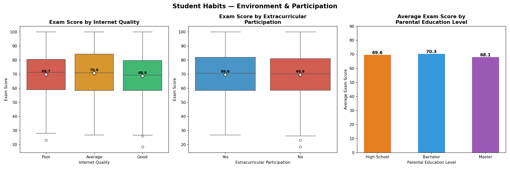
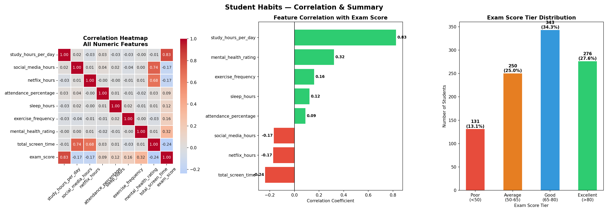

# 📚 Student Habits vs Academic Performance — Exploratory Data Analysis

An exploratory data analysis project using Python, pandas, matplotlib, and seaborn on a simulated dataset of 1,000 student records. The dataset captures daily lifestyle habits — study time, sleep, social media use, diet quality, mental health, and more — mapped against final exam scores. Every chart in this project answers one central question:

> **What habits and factors actually determine how well a student performs academically?**

---

## 📁 Project Structure

```
Student_Habits_EDA/
│
├── data_source/
│   └── student_habits.csv                    # main dataset (1,000 records)
│
├── visualizations/
│   ├── exam_score_overview.png               # Section 1 — exam score overview
│   ├── study_attendance_analysis.png         # Section 2 — study & attendance
│   ├── screen_time_analysis.png              # Section 3 — screen time & distractions
│   ├── health_lifestyle_analysis.png         # Section 4 — health & lifestyle
│   ├── environment_participation.png         # Section 5 — environment & participation
│   └── correlation_summary.png              # Section 6 — correlation & summary
│
└── student_habits_eda.ipynb                  # EDA notebook
```

---

## 📊 Dataset Overview

| Property | Detail |
|---|---|
| Rows | 1,000 students |
| Columns | 16 (15 features + 1 target) |
| Target Variable | `exam_score` |
| Missing Values | 91 in `parental_education_level` — filled with mode |
| Dataset Type | Simulated but realistic |

### Columns

| Column | Type | Description |
|---|---|---|
| `student_id` | object | Unique student identifier (dropped) |
| `age` | int | Student age |
| `gender` | object | Female / Male / Other |
| `study_hours_per_day` | float | Daily study hours |
| `social_media_hours` | float | Daily social media hours |
| `netflix_hours` | float | Daily Netflix hours |
| `part_time_job` | object | Yes / No |
| `attendance_percentage` | float | Class attendance % |
| `sleep_hours` | float | Daily sleep hours |
| `diet_quality` | object | Poor / Fair / Good |
| `exercise_frequency` | int | Days per week |
| `parental_education_level` | object | High School / Bachelor / Master |
| `internet_quality` | object | Poor / Average / Good |
| `mental_health_rating` | int | 1–10 scale |
| `extracurricular_participation` | object | Yes / No |
| `exam_score` | float | Final exam score (target) |

### Engineered Features
```python
df['total_screen_time'] = df['social_media_hours'] + df['netflix_hours']
df['exam_tier'] = pd.cut(df['exam_score'],
                          bins=[0, 50, 65, 80, 100],
                          labels=['Poor', 'Average', 'Good', 'Excellent'])
```

---

## 🔍 Feature Correlation with Exam Score

| Feature | Correlation | Direction |
|---|---|---|
| `study_hours_per_day` | **0.83** | ✅ Strong positive |
| `mental_health_rating` | **0.32** | ✅ Moderate positive |
| `exercise_frequency` | **0.16** | ✅ Weak positive |
| `sleep_hours` | **0.12** | ✅ Weak positive |
| `attendance_percentage` | **0.09** | ✅ Very weak positive |
| `social_media_hours` | **-0.17** | 🔴 Weak negative |
| `netflix_hours` | **-0.17** | 🔴 Weak negative |
| `total_screen_time` | **-0.24** | 🔴 Moderate negative |

---

## 📈 Analysis & Insights

### Section 1 — Exam Score Overview

**Distribution:**
- Scores range from ~18 to 100
- Mean **69.6**, Median **70.5** — slightly left skewed
- Most students score between 60–80
- Roughly normal distribution with a slight left tail

**By Gender:**
- Nearly identical — Female 69.7, Male 69.4, Other 70.6
- Gender is not a meaningful predictor of exam score

**By Part Time Job:**
- Students without jobs score slightly higher — 69.8 vs 68.7
- Minimal impact — only 1.1 point difference

**By Parental Education:**
- Bachelor parents produce highest scoring students (70.3)
- Master's degree parents lowest at 68.1 — counterintuitive
- Only 2.2 points between highest and lowest — not a meaningful predictor



---

### Section 2 — Study & Attendance

**Study Hours vs Exam Score:**
- Correlation of **0.83** — the strongest predictor in the entire dataset
- Clear upward trend — every additional hour of study meaningfully increases scores
- Students studying 6+ hours score consistently above 80

**Attendance vs Exam Score:**
- Correlation of only **0.09** — surprisingly weak
- Showing up to class without studying is not enough
- Attendance alone cannot predict academic performance

**Distributions:**
- Average study time — **3.6 hrs/day** (mean), **3.5 hrs** (median)
- Average attendance — **84.1%** (mean), **84.4%** (median)
- Spike at 100% attendance — a notable group of perfect attenders



---

### Section 3 — Screen Time & Distractions

**Social Media vs Exam Score:**
- Correlation of **-0.17** — weak negative relationship
- More social media = slightly lower scores
- Not a strong standalone predictor

**Netflix vs Exam Score:**
- Identical correlation of **-0.17** — same impact as social media
- Neither platform is significantly worse than the other

**Total Screen Time vs Exam Score:**
- Combined correlation of **-0.24** — stronger than either alone
- Students with 8+ hours of screen time rarely score above 80

**Screen Time by Exam Tier:**
- Poor students — **5.0 hrs** screen time per day
- Average students — **4.5 hrs**
- Good students — **4.3 hrs**
- Excellent students — **3.8 hrs**
- Every tier step up = 0.4–0.5 fewer hours on screens



---

### Section 4 — Health & Lifestyle

**Sleep Hours vs Exam Score:**
- Correlation of **0.12** — weak positive
- More sleep helps slightly but wide scatter shows it isn't decisive
- Students sleeping 3–4 hours still score 70+ in some cases

**Diet Quality:**
- Fair diet (70.4) outperforms Good (69.4) and Poor (68.1)
- Only 2.3 points between Poor and Fair — not a meaningful predictor

**Exercise Frequency:**
- Correlation of **0.16** — weak positive
- Students who exercise more tend to score slightly higher
- Wide spread at every frequency level

**Mental Health Rating:**
- Correlation of **0.32** — strongest health factor by far
- Students rating mental health 2–3 average around 60
- Students rating mental health 9–10 average around 75+
- Mental health is the most important health factor for academic performance



---

### Section 5 — Environment & Participation

**Internet Quality:**
- Poor internet (69.7) scores slightly higher than Good internet (68.6)
- Differences are tiny — internet quality has no meaningful impact
- Possibly students with poor internet spend less time on distractions

**Extracurricular Participation:**
- Perfectly identical — both Yes and No at exactly **69.6**
- Participating in activities neither helps nor hurts scores

**Parental Education:**
- Bachelor parents (70.3) produce highest scoring students
- Only 2.2 points between highest and lowest
- Background factors do not meaningfully influence performance



---

### Section 6 — Correlation & Summary

**Heatmap Key Findings:**
- `study_hours_per_day` dominates at **0.83**
- `social_media_hours` and `netflix_hours` correlate at **0.74** with each other
- All other feature correlations are near zero — clean independent features

**Exam Score Tier Distribution:**
- Good (65–80) — **343 students (34.3%)** — most common
- Excellent (>80) — **276 students (27.6%)**
- Average (50–65) — **250 students (25.0%)**
- Poor (<50) — **131 students (13.1%)**
- Over 60% of students score above 65



---

## 🧠 Key Insights

1. **Study hours is everything** — correlation of 0.83 makes it the single most powerful predictor, far ahead of everything else

2. **Mental health matters** — second strongest predictor at 0.32, showing psychological wellbeing directly impacts academic performance

3. **Attendance is misleading** — only 0.09 correlation despite being widely assumed to predict performance

4. **Screen time consistently hurts** — excellent students spend 1.2 hours less on screens daily than poor performing students

5. **Background factors are irrelevant** — gender, parental education, internet quality, and extracurricular participation have virtually zero impact on scores

6. **Health habits have weak effects** — sleep, diet, and exercise are positive but their impact is far smaller than study habits and mental health

7. **Academic success formula** — this dataset points to two factors: how much you study (0.83) and how well you feel mentally (0.32)

---

## 🛠️ Tools Used

- Python 3.12
- pandas
- NumPy
- matplotlib
- seaborn
- scipy
- Jupyter Notebook

---

## 🚀 How to Run

1. Clone the repository
2. Install dependencies
```bash
pip install pandas numpy matplotlib seaborn scipy jupyter
```
3. Open the notebook
```bash
jupyter notebook student_habits_eda.ipynb
```

---

## 📂 Dataset

- **Source:** [Kaggle — Student Habits vs Academic Performance by Jayaanta Naath](https://www.kaggle.com/datasets/jayaantanaath/student-habits-vs-academic-performance)
- **Records:** 1,000 student records
- **Type:** Simulated but realistic dataset

---

## 👤 Author

**NIO**
Fifth exploratory data analysis portfolio project — focused on identifying which student habits and lifestyle factors actually predict academic performance
